# Operating Systems

Week 1 — Introduction

Korea University Sejong Campus, Department of Computer Science

---

# Part 1. OT

Course Orientation

---

# Instructor

**Unggi Lee**, codingchild@korea.ac.kr

- Assistant Professor, Dept. of Computer Science, Korea University Sejong Campus
- Previously:
  - Assistant Professor, Dept. of Computer Engineering, Chosun University
  - AI/NLP Engineer in Global EdTech (Enuma, I-Scream Edu)
  - Elementary School Teacher
- Research ([Google Scholar](https://scholar.google.co.kr/citations?user=xnsGrp0AAAAJ)):
  - AIED: Generative AI in Education, Pedagogical Alignment, Knowledge Tracing
  - NLP & Robotics: Large Language Models (LLMs), Vision-Language-Action (VLA)
- Lab Activities ([Lab](https://codingchild2424.github.io/lab-website/)):
  - Published a VLA preprint with undergraduates at Chosun University
  - Industry–academia partnerships with Upstage, Newdive, and others
  - Collaborations with researchers in the US, Singapore, and the UK

---

# Syllabus

- You can find the syllabus in **LMS**
- Total **15 weeks**
  - 8th week — **Midterm Exam**
  - 15th week — **Final Exam**

---

# Grading

| Component | Weight |
|-----------|--------|
| Assignment | **10%** |
| Midterm Exam (written) | **30%** |
| Final Exam (written) | **30%** |
| Final Exam (project) | **30%** |
| Attendance | 0% |

> However, absent for **one-third (1/3)** or more of the total class hours → no grade will be awarded.

---

# Assignment (10%)

**In-class Quiz: 5%**
- Quizzes in **10 classes** → each **0.5%**
- Week 3, 4, 5, 6, 7, 9, 10, 11, 12, 13

**Take-home Assignment: 5%**
- Assignments in **5 classes** → each **1%**
- Week 2, 3, 4, 5, 6

---

# Midterm & Final Exam (Written)

- **Handwritten** (digital devices not allowed)
- **1 hour** each

---

# Final Exam — Project (30%)

- Starting from **Week 9**
- **3–4 members** per team
- Unlimited use of **coding agents**
  - Claude Code, Codex, Gemini CLI, OpenCode, etc.
- You must:
  - **Design and develop** an OS prototype
  - Write **OS spec documentation**
  - Give a **presentation** (in-class, Week 14)
- Evaluation:
  - Professor: **15%**
  - Students (peer review): **15%**

---

# Class Format

| Hour | Content |
|------|---------|
| **1st** | Theory Lecture (Part 1) |
| **2nd** | Theory Lecture (Part 2) + Quiz |
| **3rd** | Hands-on Lab |

- Textbook: Silberschatz, **Operating System Concepts** 10th Edition
- Lab reference: **xv6** (RISC-V), MIT 6.1810

---

# Part 2. What is an Operating System?

A Big-Picture Overview

---

# What is an Operating System?

- The **one program running at all times** on the computer = **Kernel**
- Everything else is either a **system program** or an **application program**

<br>

**OS is like a government:**
> It does not perform useful functions by itself, but provides an **environment** in which other programs can do useful work.

---

# Where the OS Sits

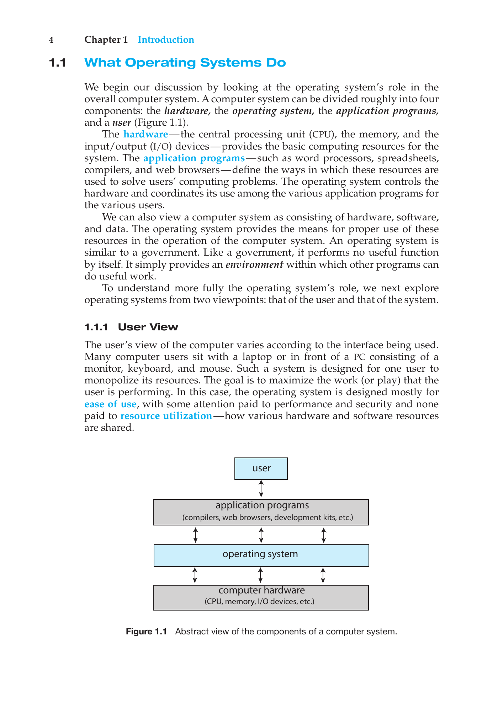

<p class="text-xs text-gray-500 text-center">Silberschatz, Figure 1.1 — Abstract view of the components of a computer system</p>

- The OS sits **between** hardware and applications
- It directly controls hardware and provides a **clean interface** to programs

---

# Two Roles of the OS

<div class="grid grid-cols-2 gap-8 mt-4">
<div class="border-l-4 border-blue-400 pl-4">

### Resource Allocator

Manages and distributes **limited resources** efficiently and fairly:

- **CPU time** — which process runs when
- **Memory space** — allocation to each process
- **Storage & I/O** — disk access, device sharing

</div>
<div class="border-l-4 border-red-400 pl-4">

### Control Program

Controls execution of user programs, prevents errors and misuse:

- **Manage execution** — start, stop, schedule programs
- **Prevent errors** — catch illegal operations
- **Enforce isolation** — protect processes from each other

</div>
</div>

---

# How Does the OS Protect Itself?

**Dual-Mode Operation**

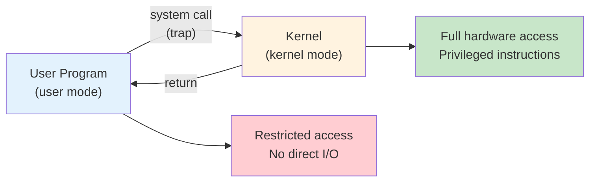

| Mode | Mode bit | Who runs here |
|------|----------|--------------|
| **Kernel mode** | 0 | OS kernel — full hardware access |
| **User mode** | 1 | Applications — restricted access |

---

# System Calls — The OS API

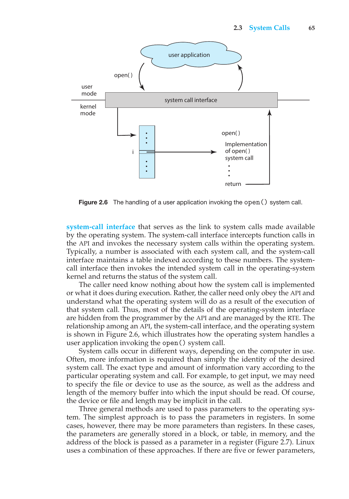

<p class="text-xs text-gray-500 text-center">Silberschatz, Figure 2.6 — The handling of a user application invoking the open() system call</p>

- **System call** = the only way for user programs to request OS services
- User program → C library → `syscall` instruction (trap) → kernel handles it → return
- Even a simple `cp in.txt out.txt` triggers **thousands** of system calls

---

# How a Computer System Works

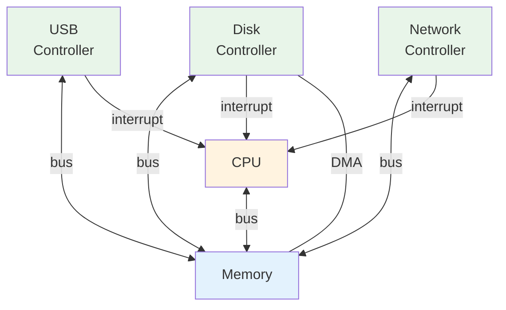

- Devices signal completion via **interrupts**
- **DMA** (Direct Memory Access): bulk data transfer without CPU intervention

---

# Storage Hierarchy

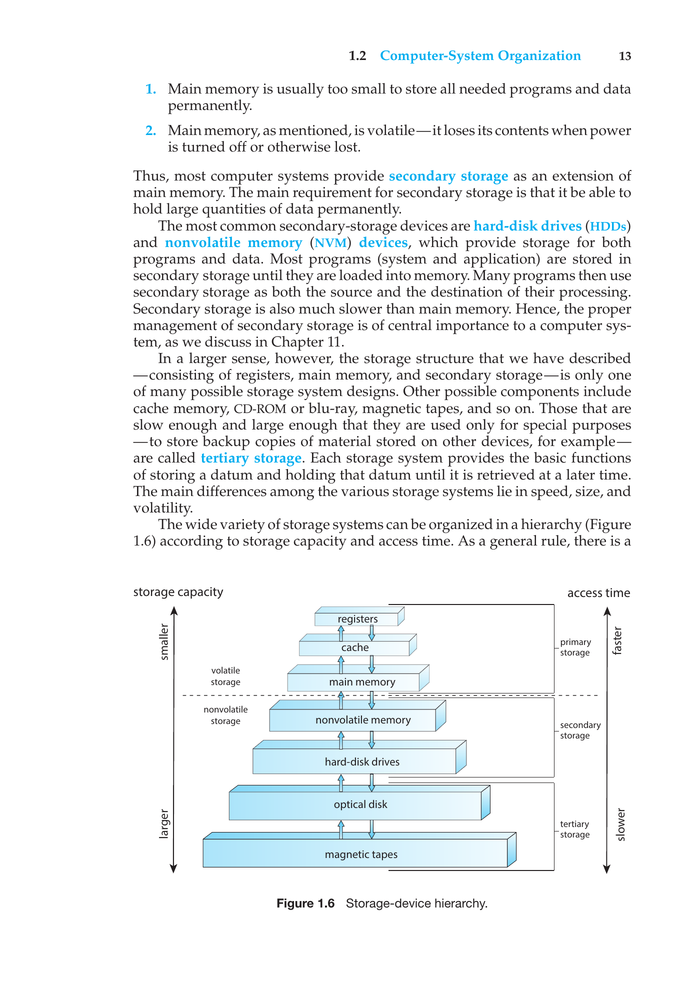

<p class="text-xs text-gray-500 text-center">Silberschatz, Figure 1.6 — Storage-device hierarchy</p>

| Level | Size | Access Time | Managed by |
|-------|------|-------------|------------|
| **Registers** | < 1 KB | ~0.3 ns | Hardware |
| **Cache (L1/L2)** | < 64 MB | ~1–25 ns | Hardware |
| **Main Memory** | < 64 GB | ~100 ns | **OS** |
| **SSD** | < 4 TB | ~50 us | **OS** |
| **HDD** | < 20 TB | ~5 ms | **OS** |

---

# OS Structures

<div class="grid grid-cols-3 gap-4">
<div class="col-span-2">

| Structure | Key Idea | Example |
|-----------|----------|---------|
| **Monolithic** | Everything in one kernel binary | Linux, traditional UNIX |
| **Microkernel** | Minimal kernel + user-space services | Mach, QNX |
| **Hybrid** | Mix of both | macOS (Mach + BSD), Windows |
| **Loadable Modules** | Core kernel + dynamic modules | Linux (LKM) |

Most modern OSes are **hybrid** — pragmatic, not pure.

</div>
<div class="flex items-center justify-center">
  
</div>
</div>

---

# What We'll Use: xv6

<div class="grid grid-cols-3 gap-4">
<div class="col-span-2">

- **xv6**: A simple, Unix-like teaching OS by MIT
- Written in **C** for **RISC-V** architecture
- ~10,000 lines of code — small enough to read entirely
- Implements: processes, virtual memory, file system, shell
- We'll **read, modify, and extend** xv6 throughout the semester

```bash
git clone https://github.com/mit-pdos/xv6-riscv
cd xv6-riscv
make qemu    # Boot xv6 in QEMU emulator
```

</div>
<div class="flex items-center justify-center">
  
</div>
</div>

---

# Part 3. Semester Preview

A taste of what's coming in each topic area

---

# Preview: Process (Week 2–3)

A **process** = a program in execution, with its own memory and state

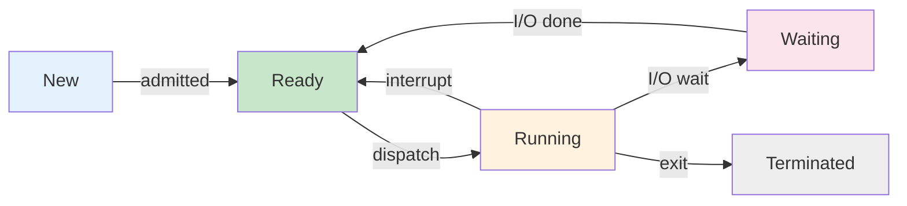

- Key system calls: **`fork()`**, **`exec()`**, **`wait()`**, **`exit()`**
- `fork()` creates a **copy** of the current process (parent → child)
- `exec()` **replaces** the process image with a new program
- In xv6: `kernel/proc.c` — the process table and state transitions

---

# Preview: Threads & Concurrency (Week 4–5)

A **thread** = a lightweight execution unit that shares its process's address space

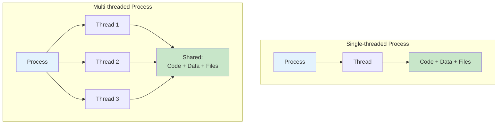

- Multiple threads in one process → **parallelism** on multi-core CPUs
- Challenge: **race conditions** when threads access shared data simultaneously

---

# Preview: CPU Scheduling (Week 6–7)

The OS decides **which process runs next** on the CPU

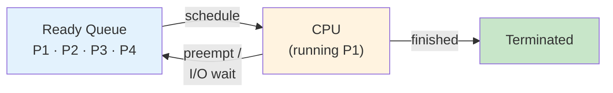

**Scheduling algorithms** balance competing goals:

| Algorithm | Idea | Trade-off |
|-----------|------|-----------|
| **FCFS** | First come, first served | Simple but convoy effect |
| **SJF** | Shortest job first | Optimal avg wait, hard to predict |
| **Round Robin** | Fixed time slice, rotate | Fair, good response time |
| **Priority** | Highest priority first | Risk of starvation |

---

# Preview: Synchronization (Week 9)

When multiple threads share data, we need **coordination**

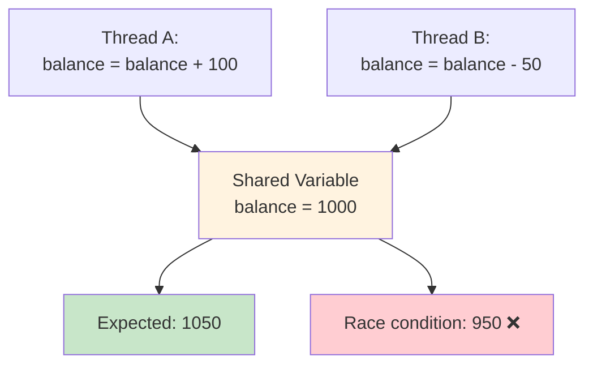

- **Critical section**: code that accesses shared resources
- **Locks** (mutexes): ensure only one thread enters at a time
- **Semaphores** and **condition variables**: more flexible coordination
- Classic problems: Producer-Consumer, Readers-Writers, Dining Philosophers

---

# Preview: Deadlocks (Week 10)

**Deadlock** = two or more processes each waiting for the other to release a resource

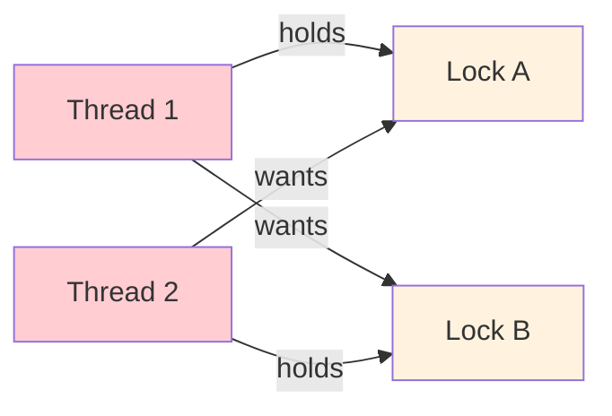

**Four conditions** (all must hold): Mutual exclusion · Hold and wait · No preemption · **Circular wait**

**Solutions**: Lock ordering · `trylock` + back-off · Deadlock detection & recovery

---

# Preview: Memory Management (Week 11–12)

**Virtual memory** gives each process its own private address space

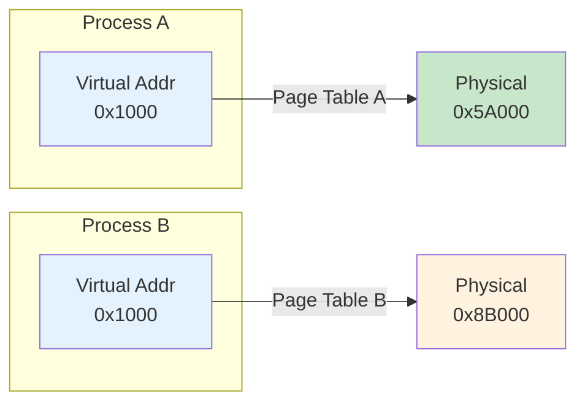

- Same virtual address → **different** physical locations (isolation!)
- **Page table**: per-process mapping from virtual pages to physical frames
- Enables **COW fork**, **lazy allocation**, **memory-mapped files**
- In xv6: RISC-V **Sv39** — 3-level page table, 39-bit virtual addresses

---

# Preview: File System & Security (Week 13–14)

**File system** organizes persistent data in layers

| Layer | Component | Key Functions |
|-------|-----------|---------------|
| 6 | **File Descriptors** | `open()`, `read()`, `write()`, `close()` |
| 5 | **Pathnames** | `namei()` — resolve `/path/to/file` |
| 4 | **Directories** | `dirlookup()`, `dirlink()` |
| 3 | **Inodes** | `ialloc()`, `readi()`, `writei()` |
| 2 | **Logging** | Crash safety via write-ahead log |
| 1 | **Buffer Cache** | `bread()`, `bwrite()` — cache disk blocks |
| 0 | **Disk** | Physical block device |

- Each layer relies **only** on the layer below — clean, modular design
- **Security** (Week 14): Protection rings, access control, encryption

---

# Course Roadmap

| Week | Topic | Week | Topic |
|------|-------|------|-------|
| **1** | Introduction + Coding Agents | **9** | Synchronization |
| **2–3** | Process | **10** | Deadlocks |
| **4–5** | Thread & Concurrency | **11–12** | Memory Management |
| **6–7** | CPU Scheduling | **13** | File System |
| **8** | _Midterm Exam_ | **14** | Security + Project Presentation |
| | | **15** | _Final Exam (Written)_ |

---

# Summary

- **OS = Kernel**: The always-running program that manages hardware resources
- **Dual-mode** (user / kernel) protects the OS from user programs
- **System calls** are the interface between applications and the kernel
- Key topics: **Process, Thread, Scheduling, Sync, Memory, File System**
- We'll use **xv6** to see how a real OS works inside
- Next week: **Process** — fork, exec, wait, pipe

---

# Q & A

codingchild@korea.ac.kr
