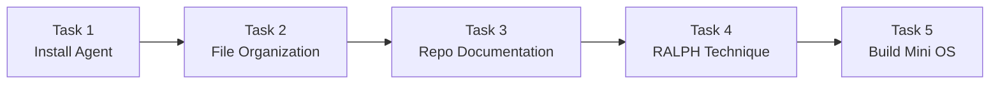
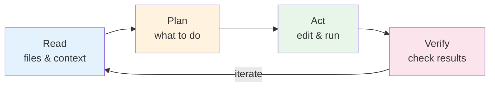
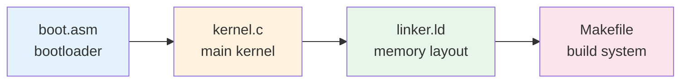

# Operating Systems Lab

## Week 1 — Coding Agents

Korea University Sejong Campus, Department of Computer Science & Software

---

# Lab Overview

- **Goal**: Install and use an AI-powered coding agent for real development tasks
- **Duration**: ~50 minutes
- **Submission**: None — exploration lab
- These tools will be used **throughout the semester** for labs and assignments



---

# What Are Coding Agents?

AI-powered CLI tools that understand and generate code **in context**



- Can read your file system, run commands, and make edits autonomously
- Useful for: scaffolding, refactoring, documentation, debugging

> **Example**: _"Create a Makefile for a C project with debug and release targets"_
> Agent: reads directory → writes Makefile → confirms build succeeds

---

# Available Agents

<div class="grid grid-cols-3 gap-6 mt-4">
<div class="text-center">
  
  <strong>Gemini CLI</strong><br/>
  <span class="text-sm text-green-600">Free (1000 calls/day)</span><br/>
  <span class="text-xs">Google's agent<br/>Good default choice</span>
</div>
<div class="text-center">
  
  <strong>Claude Code</strong><br/>
  <span class="text-sm text-orange-600">Paid</span><br/>
  <span class="text-xs">Anthropic's agent<br/>Strong multi-file reasoning</span>
</div>
<div class="text-center">
  
  <strong>Codex CLI</strong><br/>
  <span class="text-sm text-orange-600">Paid</span><br/>
  <span class="text-xs">OpenAI's agent<br/>Open-source CLI</span>
</div>
</div>

Also available: **OpenCode** (open-source harness — use any model including open-source LLMs)

> **Recommendation**: Install **Gemini CLI** if you have no preference — it's free and easy to set up.

---

# Task 1 — Install a Coding Agent

Install at least one coding agent by following its official documentation.

**Installation commands:**

```bash
npm install -g @google/gemini-cli           # Gemini CLI (free)
npm install -g @anthropic-ai/claude-code    # Claude Code (paid)
```

**Verify installation:**

```bash
gemini --version    # or: claude --version
```

**What to check:**
- The CLI launches without errors
- You can authenticate (Google account for Gemini, Anthropic account for Claude)
- Try a simple prompt: `"What is 2 + 2?"` to confirm it responds

---

# Task 2 — Organize Files

Use the agent to **organize files** in a messy directory.

**Example prompt:**

```
"Organize the files in ~/Downloads by file type into subfolders
 (images, documents, code, etc.). Show me the plan before executing."
```

**What to observe:**
- Does the agent **ask for confirmation** before moving files?
- Does it create a sensible folder structure?
- Does it handle edge cases (e.g., files with no extension)?

**Discussion:**
- What would happen if you didn't say _"show me the plan first"_?
- How do you give the agent more specific instructions if the result isn't right?

---

# Task 3 — Document a GitHub Repo

Use the agent to **generate a README.md** for an existing codebase.

**Pick a target repository:**
- Your own project, or a public repo such as:
  - `https://github.com/code-yeongyu/oh-my-opencode`

**Example prompt:**

```
"Read this codebase and generate a comprehensive README.md
 with architecture overview, setup instructions, and usage examples."
```

**Evaluate the output:**
- Does the README **accurately** describe the project?
- Are the setup instructions correct and complete?
- Is anything missing (license, contributing guide, screenshots)?

> Save this README — you'll improve it in the next task.

---

# Task 4 — RALPH Technique

<div class="grid grid-cols-3 gap-6">
<div class="col-span-2">

Create a **verifiable evaluation rubric** and use it to iteratively improve output quality.

**R**equest → **A**nalyze → **L**ist issues → **P**rompt again → **H**armonize

**Step-by-step:**

1. Ask the agent to generate a rubric (e.g., _"What makes a top-tier README?"_)
2. Ask the agent to **evaluate its own output** against the rubric
3. Ask it to fix all identified issues
4. Repeat until all criteria are met

**Key phrases to try:**
- _"Keep going until the criteria are met"_
- _"Evaluate against the rubric and fix all issues"_

</div>
<div class="flex items-center justify-center">

</div>
</div>

---

# Task 4 — RALPH in Practice

**Example workflow using the README from Task 3:**

```
You:   "Generate a rubric for evaluating a high-quality open-source README."
Agent: Returns 8 criteria (description, install, usage, architecture, ...)

You:   "Now evaluate the README you wrote against this rubric. Score each criterion."
Agent: Scores 6/8 — missing: architecture diagram, contributing guide.

You:   "Fix all failing criteria. Add an architecture diagram and contributing guide."
Agent: Updates the README with both additions.

You:   "Re-evaluate. Are all criteria met now?"
Agent: 8/8 — all criteria satisfied.
```

**Why this matters:**
- Agents produce _good-enough_ output on first try, but **not perfect**
- The RALPH loop teaches you to **systematically improve** agent output
- This skill transfers to any AI tool, not just coding agents

---

# Task 5 — Build a Mini OS

Use the agent to **build a minimal operating system** — a preview of the final project.

**Example prompt:**

```
"Create a minimal bootable OS for x86 that prints 'Hello, OS!'
 to the screen. Include a Makefile and instructions to run it in QEMU."
```

**Expected output files:**



---

# Task 5 — What to Observe

You do **not** need to successfully boot the OS — the **process** matters.

**Watch how the agent:**
- Breaks a complex problem into multiple files
- Explains each component's role
- Handles errors when you give feedback
- Iterates on build failures (if any)

**Try follow-up prompts:**
- _"Add keyboard input support"_
- _"Explain what the linker script does line by line"_
- _"The build fails with error X — fix it"_

**Connection to the course:**
- In **Week 9**, you'll form teams of 3–4
- Your **final project** is building an OS prototype using coding agents
- This task gives you a first taste of that workflow

---

# Summary & Next Steps

**What we practiced today:**

| Task | Skill Learned |
|---|---|
| 1. Install agent | Tool setup, authentication, basic prompting |
| 2. File organization | Delegating real tasks, reviewing agent decisions |
| 3. Repo documentation | Evaluating AI-generated technical writing |
| 4. RALPH technique | Systematic iterative refinement with rubrics |
| 5. Mini OS | Tackling complex multi-file systems projects |

**Coming up — Week 2 Lab**: Process system calls (`fork`, `exec`, `wait`, `pipe`)

> Coding agents are tools — understanding what they produce is still **your** responsibility.
