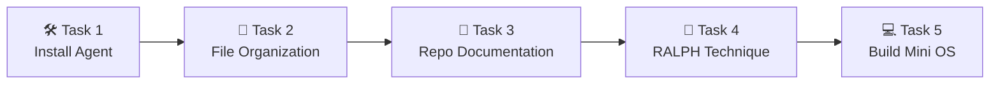
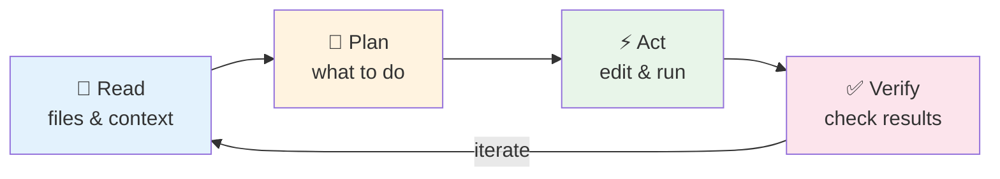
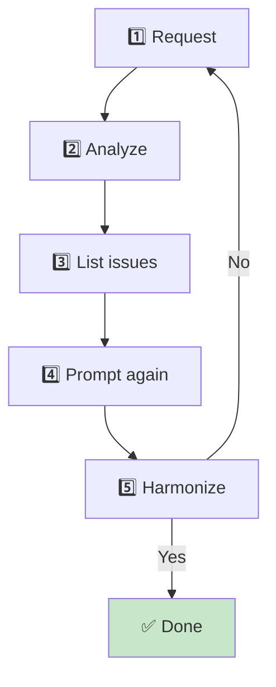
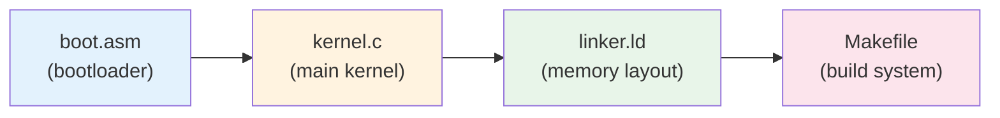

# Operating Systems Lab

## Week 1 — Coding Agents

Korea University Sejong Campus, Department of Computer Science

---

# Lab Overview

- **Goal**: Get comfortable using AI-powered coding agents
- **Duration**: ~50 minutes
- **Submission**: None — exploration lab
- **5 Tasks**: Install → File Org → Repo Docs → RALPH → Mini OS



---

# What Are Coding Agents?

AI-powered CLI tools that understand and generate code **in context**



- Can read your file system, run commands, and make edits autonomously
- Useful for: scaffolding, refactoring, documentation, debugging

> **Example**: _"Create a Makefile for a C project with debug and release targets"_
> Agent: reads directory → writes Makefile → confirms build succeeds

---

# Available Agents

<div class="grid grid-cols-3 gap-6 mt-4">
<div class="text-center">
  
  <strong>Gemini CLI</strong><br/>
  <span class="text-sm text-green-600">Free</span><br/>
  <span class="text-xs">Google's agent<br/>Good default choice</span>
</div>
<div class="text-center">
  
  <strong>Claude Code</strong><br/>
  <span class="text-sm text-orange-600">Paid</span><br/>
  <span class="text-xs">Anthropic's agent<br/>Strong multi-file reasoning</span>
</div>
<div class="text-center">
  
  <strong>Codex CLI</strong><br/>
  <span class="text-sm text-orange-600">Paid</span><br/>
  <span class="text-xs">OpenAI's agent<br/>Open-source CLI</span>
</div>
</div>

<br/>

> **Recommendation**: Install **Gemini CLI** if you have no preference — it's free and easy to set up.

---

# Task 1 & 2: Install & File Organization

<div class="grid grid-cols-2 gap-6">
<div>

### Task 1 — Install a Coding Agent

1. Follow the official install guide
2. Verify: `gemini --version`
3. Authenticate with your account

</div>
<div>

### Task 2 — File Organization

Point the agent at a messy directory:

```
"Organize the files in ./downloads
 into subfolders by type and date"
```

Review — did the agent make sensible decisions?

</div>
</div>

---

# Task 3 & 4: Repo Docs & RALPH

<div class="grid grid-cols-2 gap-6">
<div>

### Task 3 — GitHub Repo Documentation

- Open an existing GitHub repository
- Ask the agent to generate a `README.md`
- Check: does it accurately describe the project?

</div>
<div>

### Task 4 — RALPH Technique

<div class="flex items-start gap-3">

<div>

**R**equest → **A**nalyze → **L**ist issues → **P**rompt again → **H**armonize



Practice this loop on the README from Task 3.

</div>
</div>

</div>
</div>

---

# Task 5: Build a Mini OS

Ask your coding agent to scaffold a minimal OS kernel in C:

```
"Create a minimal x86 OS kernel in C that boots with GRUB,
 prints 'Hello, OS!' to the screen, and halts.
 Include a Makefile and linker script."
```



- Observe how the agent breaks the problem into files
- You do **not** need to successfully boot it — the **process** matters

---

# Summary & Next Steps

**What we practiced today**

| Task | Skill |
|---|---|
| Install agent | Tool setup & authentication |
| File organization | Delegating tasks to AI |
| Repo documentation | Evaluating AI-generated output |
| RALPH technique | Iterative refinement loop |
| Mini OS | Tackling complex systems projects with AI |

<br/>

**Coming up — Week 2 Lab**: Process system calls (`fork`, `exec`, `wait`, `pipe`)

> Coding agents are tools — understanding what they produce is still **your** responsibility.
