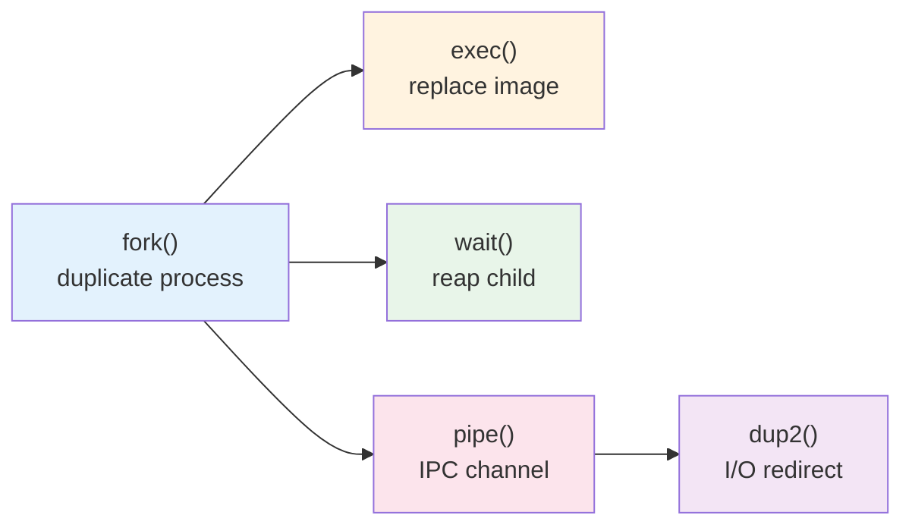
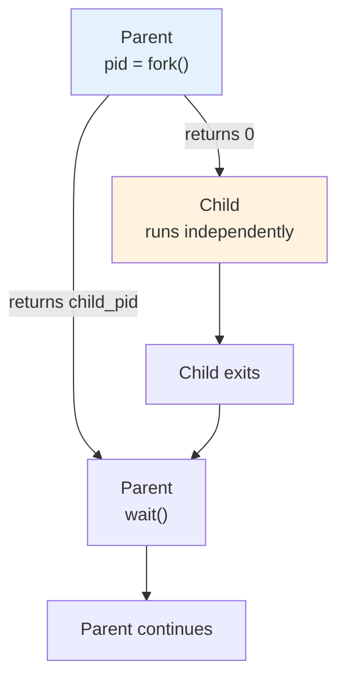
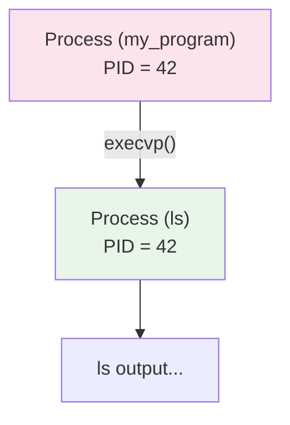
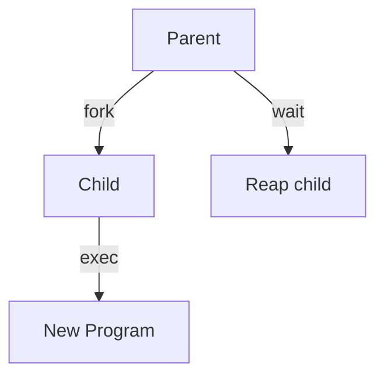
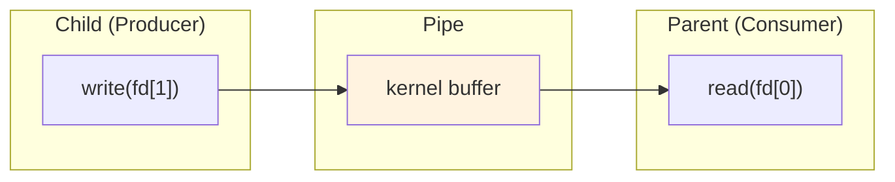
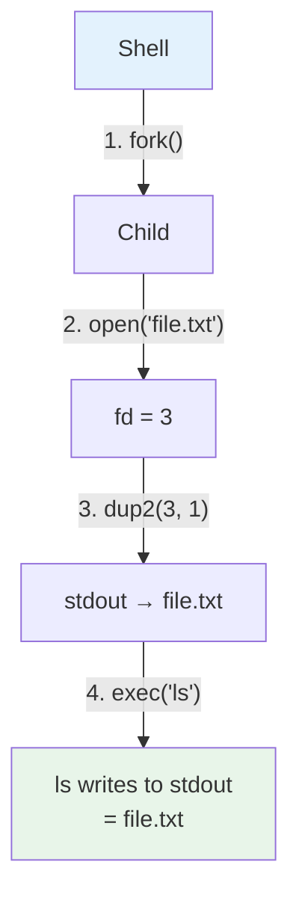
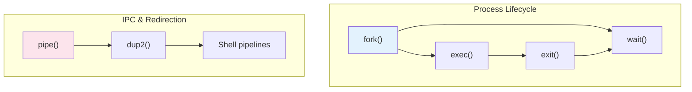

# Operating Systems Lab

## Week 2 — Process System Calls

Korea University Sejong Campus, Department of Computer Science & Software

---

# Lab Overview

- **Goal**: Practice core UNIX process system calls through C programs
- **Duration**: ~50 minutes · 4 labs
- **Topics**: `fork()`, `exec()`, `wait()`, `pipe()`, `dup()`



---

# Lab 1: fork() and wait()

`fork()` duplicates the calling process — the child gets a **copy** of the parent's address space.

<div class="grid grid-cols-2 gap-4">
<div>

```c
pid_t pid = fork();
if (pid == 0) {
    // Child process
    printf("Child PID: %d\n", getpid());
} else {
    // Parent process
    wait(NULL);
    printf("Parent: child finished\n");
}
```

</div>
<div>



</div>
</div>

- `fork()` returns **0** to child, **child PID** to parent
- `wait(NULL)` blocks until any child terminates
- **Try**: what happens if you remove `wait()`?

---

# Lab 2: exec()

`exec()` replaces the current process image with a new program. The PID does **not** change.

<div class="grid grid-cols-2 gap-4">
<div>

```c
printf("Before exec\n");

char *args[] = {"ls", "-l", NULL};
execvp("ls", args);

// Never reached if exec succeeds
printf("After exec\n");
```

</div>
<div>



**Common pattern**: `fork()` + `exec()`



</div>
</div>

---

# Lab 3: pipe()

`pipe()` creates a **unidirectional** communication channel between two file descriptors.

<div class="grid grid-cols-2 gap-4">
<div>

```c
int fd[2];
pipe(fd);  // fd[0]=read, fd[1]=write

if (fork() == 0) {
    close(fd[0]);  // close read end
    char *msg = "hello from child";
    write(fd[1], msg, strlen(msg));
    close(fd[1]);
} else {
    close(fd[1]);  // close write end
    char buf[64] = {0};
    read(fd[0], buf, sizeof(buf));
    printf("Received: %s\n", buf);
    close(fd[0]);
}
```

</div>
<div>



**Rules**:
- Always close the **unused** end
- Models **producer-consumer** pattern
- Closing write end → reader gets EOF

</div>
</div>

---

# Lab 4: dup2() and I/O Redirection

`dup2(oldfd, newfd)` makes `newfd` refer to the same file as `oldfd` — used by shells for redirection.

<div class="grid grid-cols-2 gap-4">
<div>

```c
int fd = open("output.txt",
    O_WRONLY | O_CREAT | O_TRUNC, 0644);
dup2(fd, STDOUT_FILENO);
close(fd);

// This goes to output.txt
printf("Redirected!\n");
```

</div>
<div>

**How `ls > file.txt` works:**



**Exercise**: Combine `fork()` + `pipe()` + `dup2()` to implement `ls | wc -l`

</div>
</div>

---

# Key Takeaways



| Syscall | Purpose |
|---|---|
| `fork()` | Create child process (copy of parent) |
| `exec()` | Replace process image with new program |
| `wait()` | Block until child exits; reap zombie |
| `pipe()` | Create one-way IPC channel |
| `dup2()` | Redirect file descriptors |

**Shell command** `cmd1 | cmd2` = fork + pipe + dup2 + exec (×2) + wait

> Next week: we go inside xv6 and read the kernel source that implements these calls.
