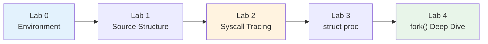
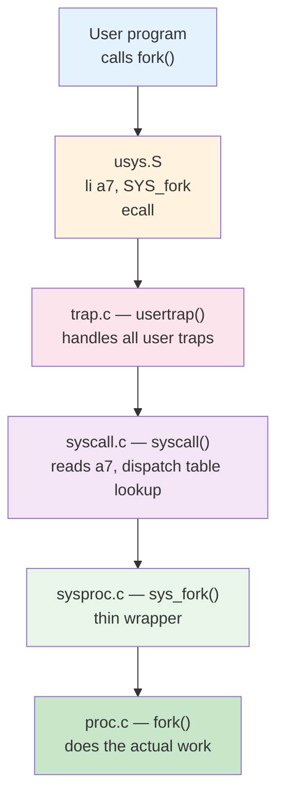
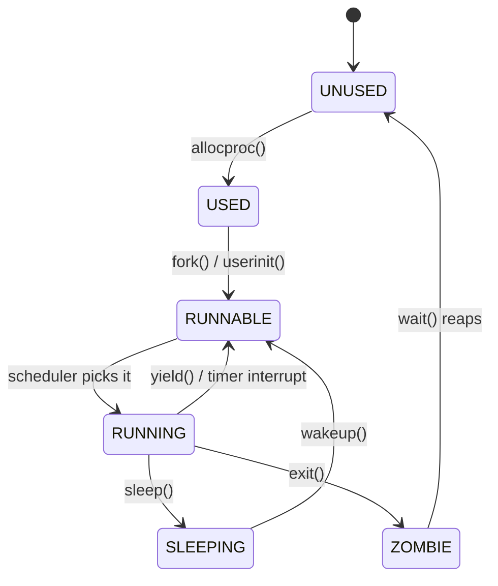
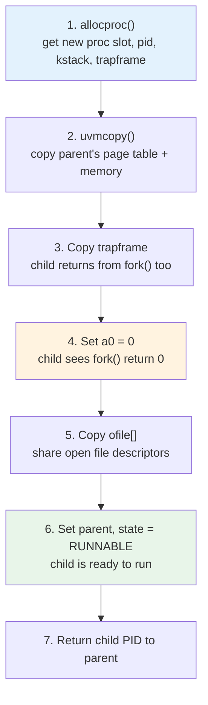
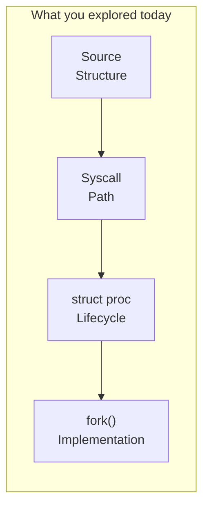

# Operating Systems Lab

## Week 3 — Exploring xv6 Internals

Korea University Sejong Campus, Department of Computer Science & Software

---

# Lab Overview

- **Goal**: Navigate xv6 kernel source and trace how system calls work end-to-end
- **Duration**: ~50 minutes · 5 labs (Lab 0–4)



---

# Lab 0 & 1: Environment & Source Structure

<div class="grid grid-cols-2 gap-4">
<div>

### Lab 0 — Verify Build

```bash
cd xv6-riscv
make qemu
# → "xv6 kernel is booting"
# → shell prompt ($)
# Exit: Ctrl-A X
```

</div>
<div>

### Lab 1 — Key Kernel Files

| File | Purpose |
|---|---|
| `proc.h` | `struct proc` definition |
| `proc.c` | fork, exit, wait, scheduler |
| `syscall.c` | syscall dispatch table |
| `sysproc.c` | syscall handlers |
| `trap.c` | trap entry from user space |
| `usys.pl` | generates user-space stubs |

</div>
</div>

---

# Lab 2: System Call Tracing

**Full path of `fork()` from user space to kernel:**



**Exercise**: Add a `printf` in `sys_fork()` and rebuild to confirm you found the right spot.

---

# Lab 3: struct proc Analysis

**Process state machine** — defined in `kernel/proc.h`:



**Key fields**: `state`, `pid`, `pagetable`, `trapframe`, `context`, `ofile[]`, `parent`

- **Exercise**: Which fields change at each state transition?

---

# Lab 3: struct proc — Full Definition

```c
struct proc {
  struct spinlock lock;
  enum procstate state;        // UNUSED → USED → RUNNABLE → RUNNING → ZOMBIE
  void *chan;                  // sleep channel (if SLEEPING)
  int killed;                 // pending kill signal
  int xstate;                 // exit status for parent
  int pid;                    // process ID

  struct proc *parent;        // parent process (protected by wait_lock)

  uint64 kstack;              // kernel stack virtual address
  uint64 sz;                  // process memory size (bytes)
  pagetable_t pagetable;      // user page table
  struct trapframe *trapframe;// saved user registers (for trampoline.S)
  struct context context;     // saved kernel registers (for swtch.S)
  struct file *ofile[NOFILE]; // open file descriptors
  struct inode *cwd;          // current working directory
  char name[16];              // process name (for debugging)
};
```

---

# Lab 4: fork() Implementation Deep Dive



**Discussion questions**:
- Why does the child need its **own** trapframe copy?
- What would happen if step 4 (`a0 = 0`) were skipped?
- Why does `uvmcopy` copy **all** pages? (Hint: Week 12 — COW fork)

---

# Key Takeaways

| Concept | Key Insight |
|---|---|
| **xv6** | ~10K lines of C — small enough to read entirely |
| **Syscall path** | user → `ecall` → `usertrap()` → `syscall()` → handler → impl |
| **struct proc** | Kernel's complete view of a process (scheduling, memory, files) |
| **fork()** | `uvmcopy` = heavy lifting; `trapframe->a0 = 0` = child return value |



> Upcoming: threads, scheduling, and synchronization — all built on top of what you explored today.
