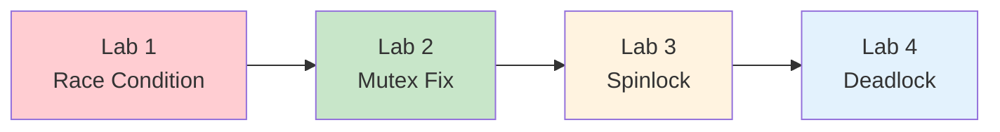
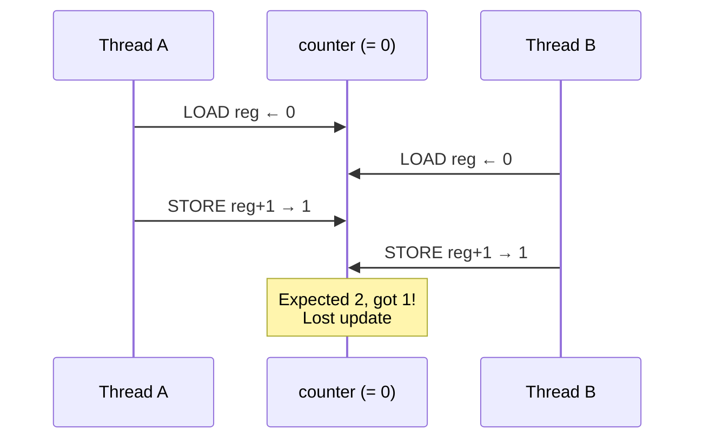
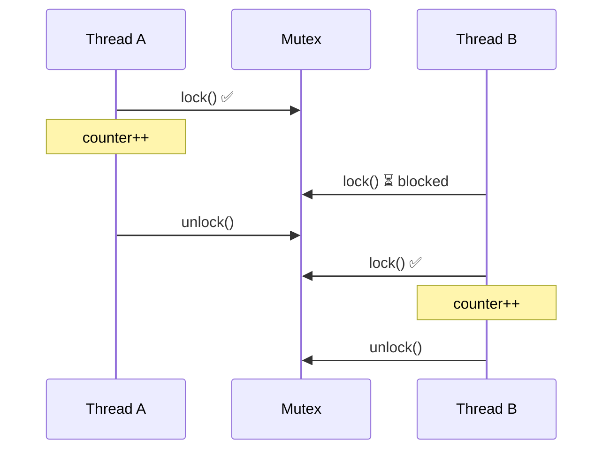
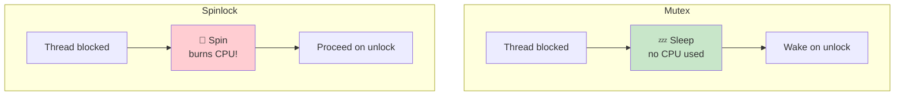
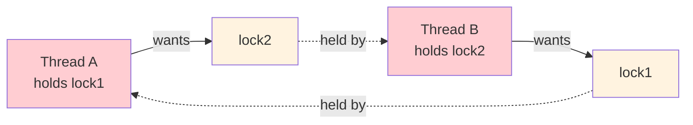
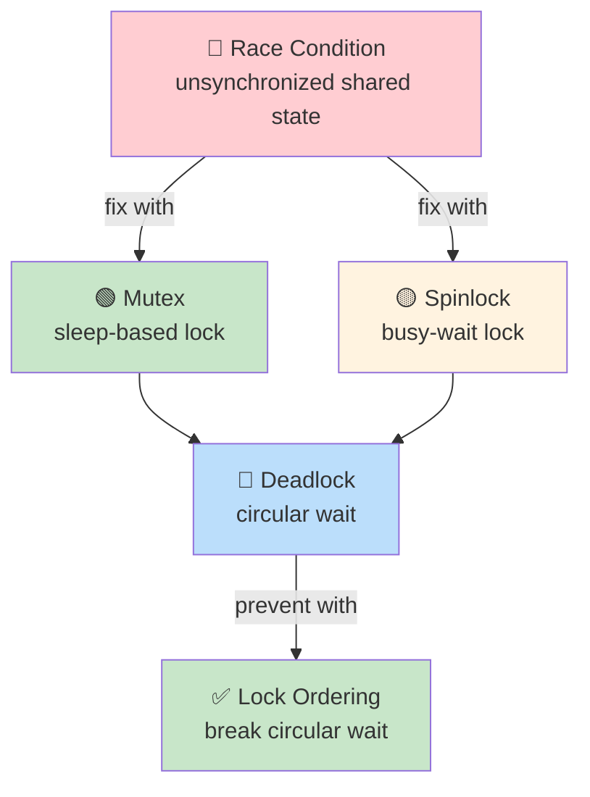

# Operating Systems Lab

## Week 4 — Race Conditions and Locks

Korea University Sejong Campus, Department of Computer Science & Software

---

# Lab Overview

**Duration**: ~50 minutes · 4 labs



**Setup**:

```bash
cd examples/
gcc -Wall -pthread -o race_demo      race_demo.c
gcc -Wall -pthread -o mutex_fix      mutex_fix.c
gcc -Wall -pthread -o spinlock_impl  spinlock_impl.c
gcc -Wall -pthread -o deadlock_demo  deadlock_demo.c
```

---

# Lab 1: Race Conditions

**Goal**: Observe that `counter++` is **not atomic**

```bash
./race_demo          # 4 threads × 1,000,000 increments
# Expected: 4,000,000  →  Actual: less, different every run!
```

**Why?** `counter++` compiles to **three** CPU instructions:



**Experiment**: Try `./race_demo 2 1000000` vs `./race_demo 8 1000000`
- More threads → more lost updates. Output is **non-deterministic**.

---

# Lab 2: Mutex Protection

**Goal**: Eliminate the race with `pthread_mutex`

<div class="grid grid-cols-2 gap-4">
<div>

```c
pthread_mutex_lock(&lock);
counter++;                // critical section
pthread_mutex_unlock(&lock);
```

```bash
./mutex_fix   # always prints 4,000,000 ✓
```

</div>
<div>



</div>
</div>

**Performance trade-off**: `time ./race_demo` (fast, wrong) vs `time ./mutex_fix` (correct, slower)

> Rule: keep the critical section **as small as possible** to minimize contention.

---

# Lab 3: Spinlock (xv6 Model)

**Spinlock** = busy-wait using atomic test-and-set (no sleeping)

<div class="grid grid-cols-2 gap-4">
<div>

**User-space spinlock core:**

```c
// acquire
while (__sync_lock_test_and_set(
    &lock->locked, 1) != 0)
    ;   // spin — burn CPU

// release
__sync_lock_release(&lock->locked);
```

**xv6 adds** (`kernel/spinlock.c`):

```c
push_off();   // disable interrupts
while (__sync_lock_test_and_set(...))
    ;
__sync_synchronize(); // memory barrier
lk->cpu = mycpu();
```

</div>
<div>

**Mutex vs Spinlock**:



| | Mutex | Spinlock |
|---|---|---|
| Wait | Sleep (no CPU) | Spin (burns CPU) |
| Best for | Long sections | Very short kernel sections |

</div>
</div>

---

# Lab 4: Deadlock Scenario

**Two threads, two locks** — classic circular wait:



```bash
./deadlock_demo   # hangs! kill with: Ctrl-C
```

**Four Coffman conditions** (ALL must hold for deadlock):

| Condition | Description |
|---|---|
| **Mutual exclusion** | Only one thread holds a lock at a time |
| **Hold and wait** | Hold one lock while requesting another |
| **No preemption** | Locks cannot be forcibly taken away |
| **Circular wait** | A cycle in the dependency graph |

**Fix**: enforce global lock ordering — always acquire `lock1` before `lock2`.

---

# Key Takeaways



**You will see these in xv6**:
- `kernel/spinlock.c` — `acquire` / `release` with interrupt disable
- `kernel/kalloc.c` — memory allocator guarded by a spinlock
- `kernel/proc.c` — process table locked per-entry
