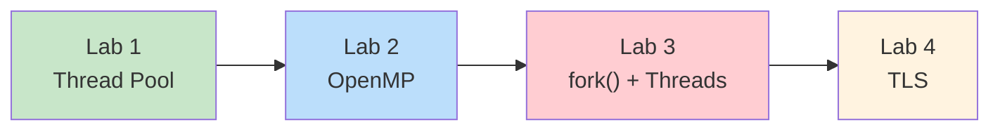
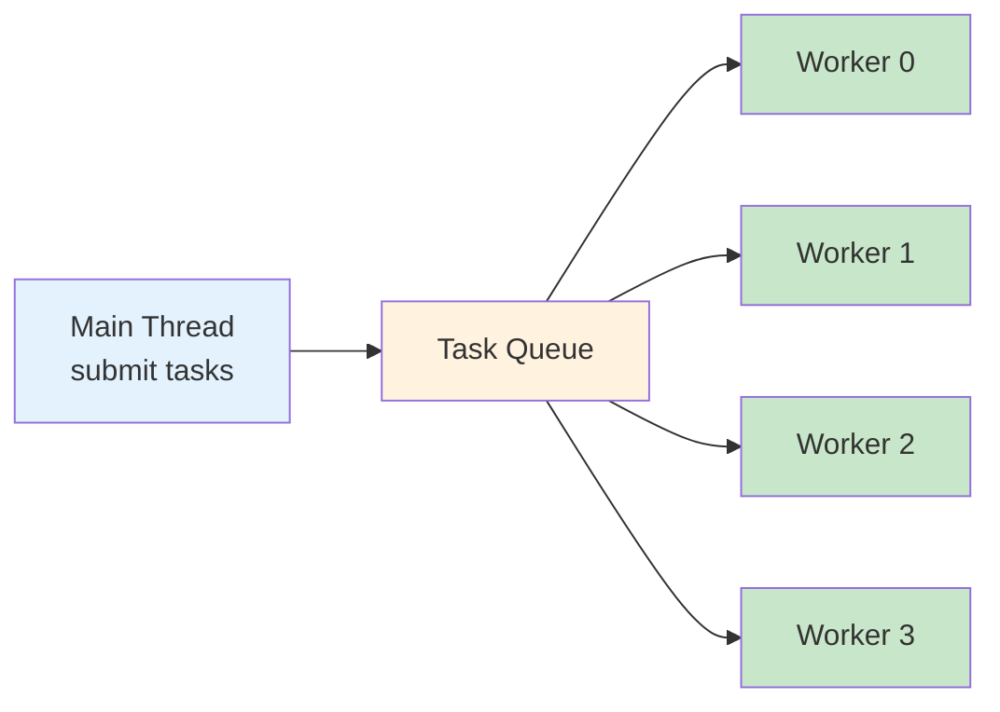
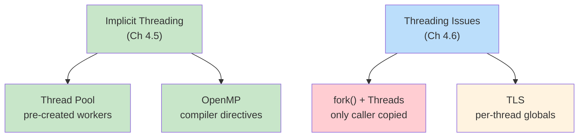

# Operating Systems Lab

## Week 5 — Implicit Threading and Threading Issues

Korea University Sejong Campus, Department of Computer Science & Software

---

# Lab Overview

**Duration**: ~50 minutes · 4 labs



**Setup**:

```bash
cd examples/
gcc -Wall -pthread -o lab1_thread_pool   lab1_thread_pool.c
gcc -Wall -fopenmp -o lab2_openmp_parallel lab2_openmp_parallel.c
gcc -Wall -pthread -o lab3_fork_threads  lab3_fork_threads.c
gcc -Wall -pthread -o lab4_tls           lab4_tls.c
```

---

# Lab 1: Thread Pool

**Goal**: Implement a task queue with pre-created worker threads (Ch 4.5.1)



**Three benefits** of thread pools:

| Benefit | Description |
|---------|-------------|
| Faster response | Reuse existing threads — no creation overhead |
| Bounded concurrency | Limit threads to prevent resource exhaustion |
| Task/execution separation | Decouple *what* from *how* |

```bash
./lab1_thread_pool    # 4 workers process 12 tasks
```

<div class="text-right text-sm text-gray-400 pt-2">

Skeleton: `examples/skeletons/lab1_thread_pool.c` · Solution: `examples/solutions/lab1_thread_pool.c`

</div>

---

# Lab 1: Thread Pool — Key Code

```c
void *worker_thread(void *arg) {
    while (1) {
        pthread_mutex_lock(&pool.lock);
        while (pool.count == 0 && !pool.shutdown)
            pthread_cond_wait(&pool.not_empty, &pool.lock);  // wait for work
        if (pool.shutdown && pool.count == 0) { unlock; break; }
        task = dequeue();
        pthread_cond_signal(&pool.not_full);  // free slot
        pthread_mutex_unlock(&pool.lock);
        task.function(task.arg);              // execute outside lock
    }
}
```

**Pattern**: Producer (main) submits tasks → Queue → Consumer (workers) execute

- Workers sleep when queue is empty (no busy-wait)
- Shutdown: set flag + `broadcast` to wake all sleeping workers
- Compare with Java `ExecutorService.newFixedThreadPool(4)`

---

# Lab 2: OpenMP Parallel

**Goal**: Use compiler directives for implicit threading (Ch 4.5.3)

<div class="grid grid-cols-2 gap-4">
<div>

**Sequential**:

```c
for (int i = 0; i < N; i++)
    sum += array[i];
```

</div>
<div>

**Parallel (OpenMP)**:

```c
#pragma omp parallel for reduction(+:sum)
for (int i = 0; i < N; i++)
    sum += array[i];
```

</div>
</div>

**Key directives**:

| Directive | Effect |
|-----------|--------|
| `#pragma omp parallel` | Create thread team |
| `#pragma omp parallel for` | Split loop iterations |
| `reduction(+:var)` | Private copies, combined at end |

```bash
./lab2_openmp_parallel
OMP_NUM_THREADS=2 ./lab2_openmp_parallel   # control thread count
```

<div class="text-right text-sm text-gray-400 pt-2">

Skeleton: `examples/skeletons/lab2_openmp_parallel.c` · Solution: `examples/solutions/lab2_openmp_parallel.c`

</div>

---

# Lab 3: fork() in Multithreaded Programs

**Goal**: Observe that fork() copies **only the calling thread** (Ch 4.6.1)

```text
Before fork():                After fork():

Parent Process                Parent Process       Child Process
┌──────────────┐             ┌──────────────┐     ┌──────────────┐
│ Main Thread  │             │ Main Thread  │     │ Main Thread  │ (copy)
│ Thread 1     │    fork()   │ Thread 1     │     │              │ (gone!)
│ Thread 2     │ ─────────→  │ Thread 2     │     │              │ (gone!)
│ Thread 3     │             │ Thread 3     │     │              │ (gone!)
│ counter = 7  │             │ counter = 10 │     │ counter = 7  │ (frozen)
└──────────────┘             └──────────────┘     └──────────────┘
```

- Parent: counter keeps incrementing (threads alive)
- Child: counter stays at 7 (threads NOT copied)
- **Safe pattern**: `fork()` + `exec()` immediately

<div class="text-right text-sm text-gray-400 pt-2">

Skeleton: `examples/skeletons/lab3_fork_threads.c` · Solution: `examples/solutions/lab3_fork_threads.c`

</div>

---

# Lab 4: Thread-Local Storage (TLS)

**Goal**: Use `__thread` for per-thread private global state (Ch 4.6.4)

<div class="grid grid-cols-2 gap-4">
<div>

**Shared global**:

```c
int shared_var = 0;

// All threads: shared_var++
// Result: RACE CONDITION
```

</div>
<div>

**Thread-local**:

```c
__thread int tls_var = 0;

// Each thread: tls_var++
// Result: always correct (100000)
```

</div>
</div>

**Real-world use**: `errno` is TLS — each thread has its own error code

```bash
./lab4_tls
# shared_var = 287453 (expected 400000) RACE CONDITION!
# Each thread's tls_var was 100000 (always correct)
```

<div class="text-right text-sm text-gray-400 pt-2">

Skeleton: `examples/skeletons/lab4_tls.c` · Solution: `examples/solutions/lab4_tls.c`

</div>

---

# Key Takeaways



| Concept | Key Insight |
|---------|-------------|
| Thread Pool | Workers wait on queue — reuse threads, bound concurrency |
| OpenMP | One pragma line → automatic parallelization |
| fork() | Only calling thread copied — call exec() right away |
| TLS | `__thread` = per-thread copy, no locks needed |
