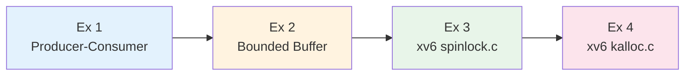
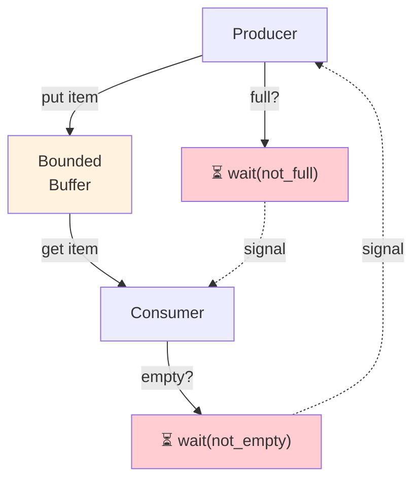
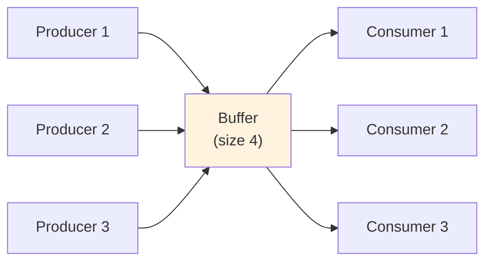
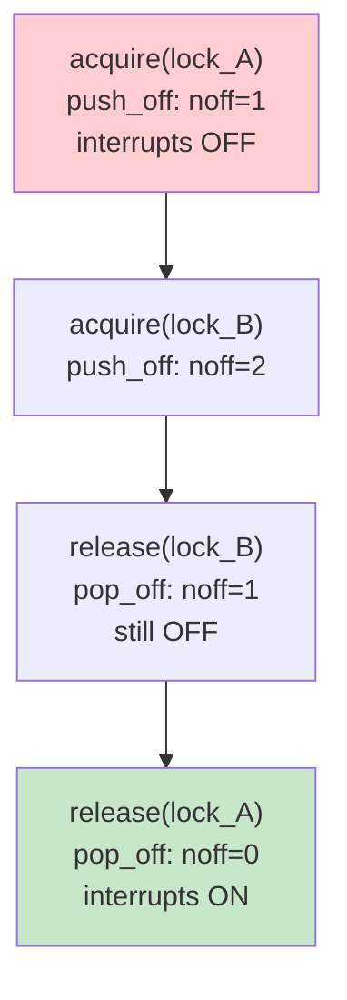
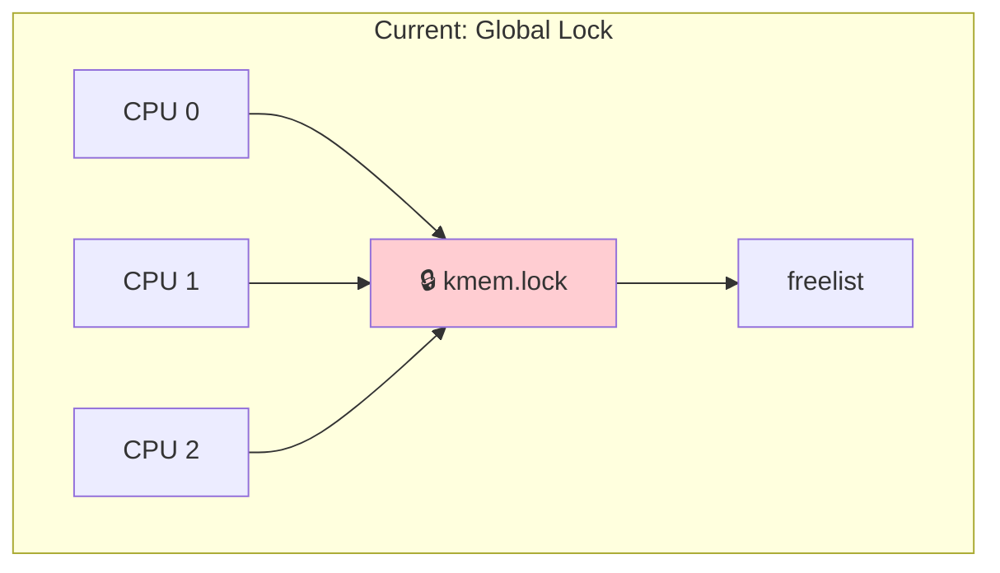
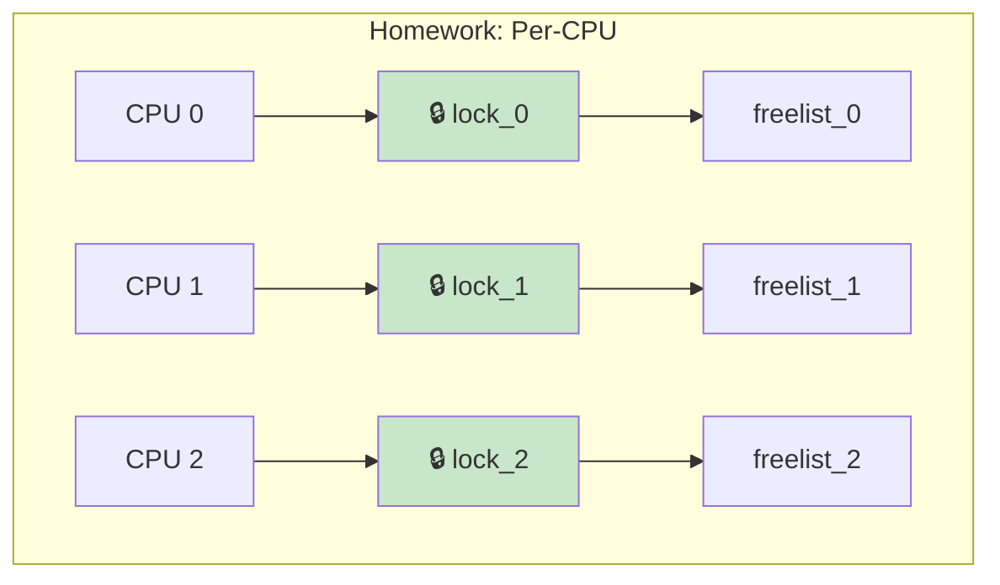
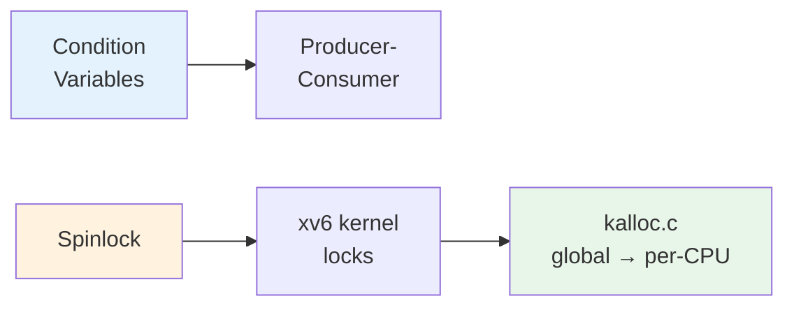

# Operating Systems Lab

## Week 5 — Advanced Synchronization

Korea University Sejong Campus, Department of Computer Science & Software

---

# Lab Overview

**Duration**: ~50 minutes · 4 exercises



**Setup**:

```bash
cd examples/
gcc -Wall -pthread -o producer_consumer  producer_consumer.c
gcc -Wall -pthread -o bounded_buffer     bounded_buffer.c
```

---

# Exercise 1: Producer-Consumer

**Goal**: Coordinate producer and consumer with **condition variable** + **mutex**

<div class="grid grid-cols-2 gap-4">
<div>

```c
// Producer
pthread_mutex_lock(&buf->mutex);
while (buf->count == BUFFER_SIZE)
    pthread_cond_wait(
        &buf->not_full,
        &buf->mutex);
buf->data[buf->in] = item;
buf->in = (buf->in + 1) % BUFFER_SIZE;
buf->count++;
pthread_cond_signal(&buf->not_empty);
pthread_mutex_unlock(&buf->mutex);
```

</div>
<div>



</div>
</div>

**Why `while`, not `if`?** — POSIX uses **Mesa semantics**: spurious wakeups are possible. Always recheck.

---

# Exercise 2: Bounded Buffer at Scale

**3 producers + 3 consumers**, `BUFFER_SIZE = 4`

```bash
./bounded_buffer   # every item produced is consumed exactly once
```

**Experiments**:

| Change | Expected Effect |
|---|---|
| Replace `while` with `if` | Assertion failures or wrong count |
| Replace `signal` with `broadcast` | Correct but more spurious wakeups |
| Set `BUFFER_SIZE = 1` | Strict alternation, low concurrency |
| Reduce consumers to 1 | Consumer bottleneck, producers wait more |



---

# Exercise 3: xv6 spinlock.c Analysis

**File**: `xv6-riscv/kernel/spinlock.c`

<div class="grid grid-cols-2 gap-4">
<div>

**`acquire` — four steps:**

```c
void acquire(struct spinlock *lk) {
  push_off();        // 1. disable interrupts
  if (holding(lk))
      panic("acquire"); // 2. re-entrancy check
  while (__sync_lock_test_and_set(
      &lk->locked, 1)) // 3. atomic spin
      ;
  __sync_synchronize(); // 4. memory barrier
  lk->cpu = mycpu();
}
```

</div>
<div>

**`push_off` / `pop_off`** — nestable interrupt disable:



Prevents self-deadlock: interrupt handler cannot spin on a lock held by the interrupted code.

</div>
</div>

---

# Exercise 4: xv6 kalloc.c Lock Analysis

**File**: `xv6-riscv/kernel/kalloc.c` — one global freelist + one lock

<div class="grid grid-cols-2 gap-4">
<div>

```c
struct {
    struct spinlock lock;
    struct run *freelist;
} kmem;  // ALL CPUs share this
```

```c
// kfree: memset BEFORE lock
memset(pa, 1, PGSIZE);
acquire(&kmem.lock);
r->next = kmem.freelist;
kmem.freelist = r;
release(&kmem.lock);

// kalloc: memset AFTER lock
acquire(&kmem.lock);
r = kmem.freelist;
if(r) kmem.freelist = r->next;
release(&kmem.lock);
memset((char*)r, 5, PGSIZE);
```

</div>
<div>

**Scalability problem:**





</div>
</div>

---

# Key Takeaways

| Concept | Key Insight |
|---|---|
| **Condition variables** | `mutex` + `cond_wait` in a `while` loop — always recheck |
| **xv6 spinlock** | disable interrupts + atomic spin + memory barrier |
| **push_off/pop_off** | nestable interrupt disable prevents self-deadlock |
| **Lock granularity** | global lock = simple but bottleneck; per-CPU = parallel |



> **Minimize work inside critical sections** — `kalloc.c` deliberately places `memset` outside the lock.
