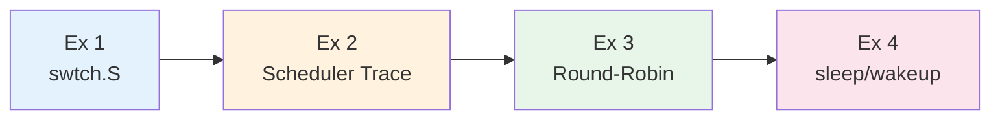
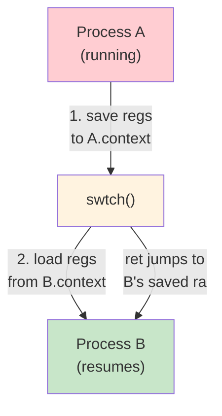
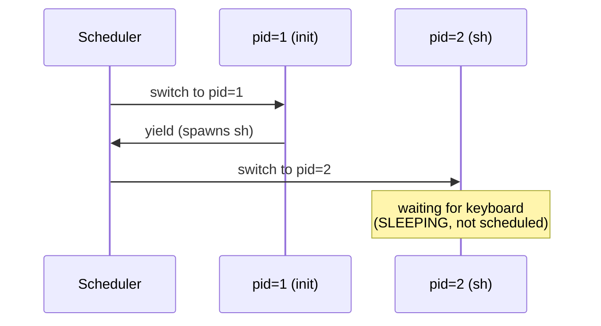
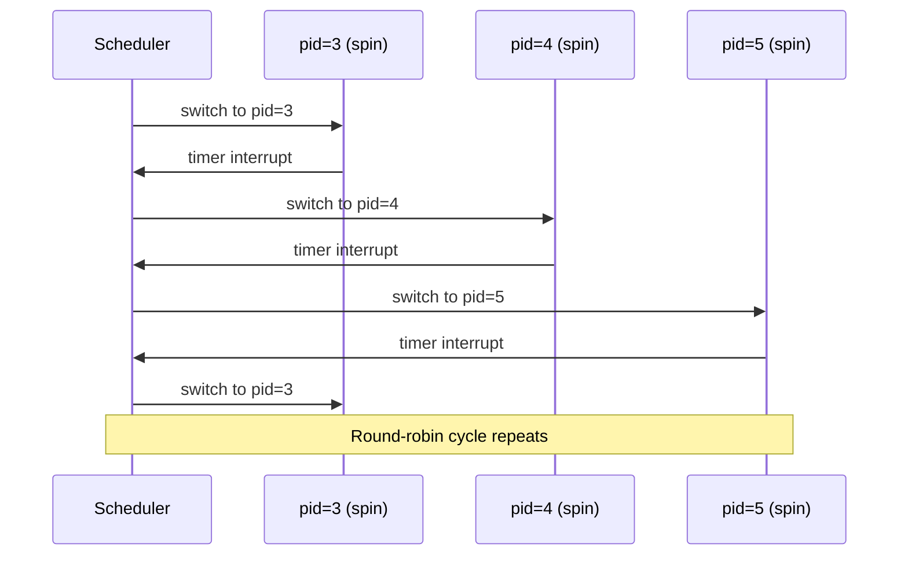
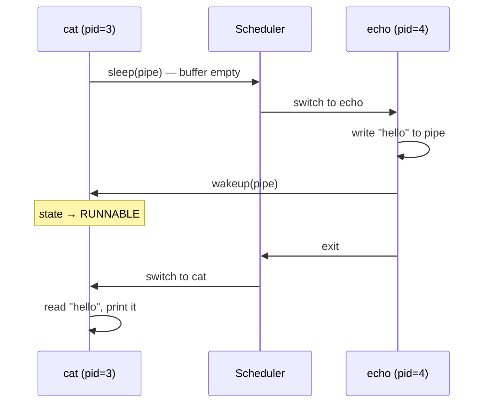
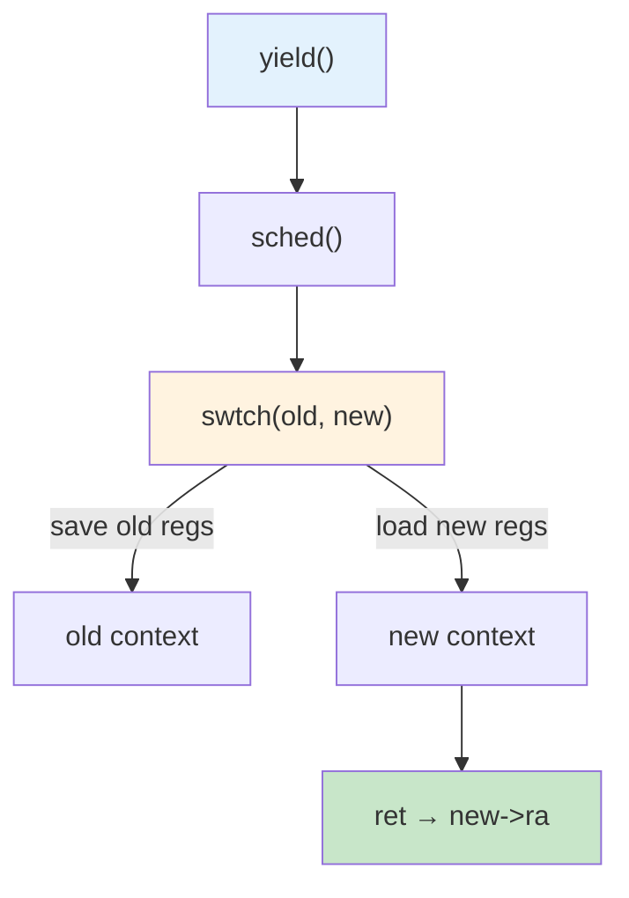

# Operating Systems Lab

## Week 6 — Context Switching

Korea University Sejong Campus, Department of Computer Science & Software

---

# Lab Overview

**Duration**: ~50 minutes · 4 exercises



**Prerequisites**:

```bash
cd xv6-riscv && make qemu   # verify clean boot
```

---

# Exercise 1: swtch.S Analysis

**Files**: `kernel/swtch.S`, `kernel/proc.h`

<div class="grid grid-cols-2 gap-4">
<div>

**`struct context`** — only **callee-saved** registers:

```c
struct context {
  uint64 ra;  // return address
  uint64 sp;  // stack pointer
  uint64 s0;  // s0 – s11
  uint64 s1;
  /* ... s2 through s11 ... */
};
```

**`swtch(old, new)`:**

```asm
swtch:
  sd ra, 0(a0)   # save to old
  sd sp, 8(a0)
  sd s0, 16(a0) ...
  ld ra, 0(a1)   # load from new
  ld sp, 8(a1)
  ld s0, 16(a1) ...
  ret             # jump to new->ra
```

</div>
<div>

**Context switch flow:**



**New process bootstrap**: `allocproc()` sets `p->context.ra = forkret` so the first `swtch` into a new process lands in `forkret()`.

</div>
</div>

---

# Exercise 2: Scheduler Tracing

**Goal**: Make the scheduler visible with `printf`

**Edit `kernel/proc.c` — inside `scheduler()`:**

```c
if (p->state == RUNNABLE) {
    printf("[sched] cpu%d: switch to pid=%d name=%s\n",
           cpuid(), p->pid, p->name);   // ← add this
    p->state = RUNNING;
    c->proc = p;
    swtch(&c->context, &p->context);
```

Or apply: `git apply scheduler_trace.patch`

```bash
make clean && make CPUS=1 qemu   # single CPU for readable output
```



---

# Exercise 3: Round-Robin Observation

**Start multiple background processes in xv6 shell:**

```
$ spin &
$ spin &
$ spin &
```



**Why round-robin?** The scheduler scans `proc[]` linearly:

```c
for (p = proc; p < &proc[NPROC]; p++) {
    if (p->state == RUNNABLE) { /* run it */ }
}
```

**Subtle bias**: lower-index processes checked first every cycle.

**Multi-CPU**: rebuild with `CPUS=3` → multiple CPUs pick different processes simultaneously.

---

# Exercise 4: sleep/wakeup Tracing

**Goal**: Follow a process through blocking and unblocking

**Add trace to `kernel/proc.c` — `sleep()` function:**

```c
printf("[sleep]  pid=%d name=%s chan=%p\n", p->pid, p->name, chan);
p->state = SLEEPING;
sched();
printf("[wakeup] pid=%d name=%s\n", p->pid, p->name);
```

**Test**: `echo hello | cat` in xv6 shell



`wakeup` only sets state to RUNNABLE — the woken process does **not** run immediately.

---

# Key Takeaways



| Concept | Key Insight |
|---|---|
| **swtch.S** | Save callee-saved regs → load new regs → `ret` to `new->ra` |
| **Scheduler** | Linear scan of `proc[]` for RUNNABLE — simple round-robin |
| **sleep/wakeup** | `sleep(chan, lk)` → SLEEPING; `wakeup(chan)` → RUNNABLE |
| **End-to-end** | yield → sched → swtch (to scheduler) → swtch (to next) → resume |
