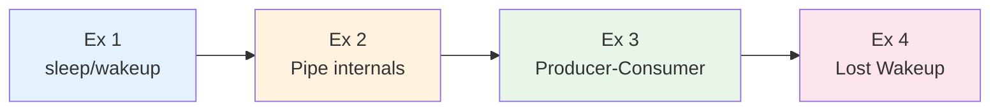
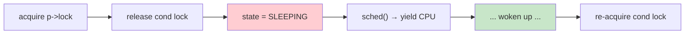
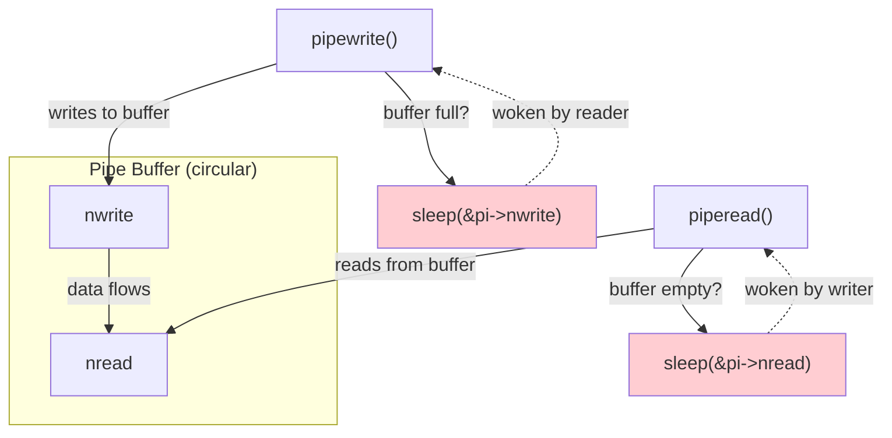
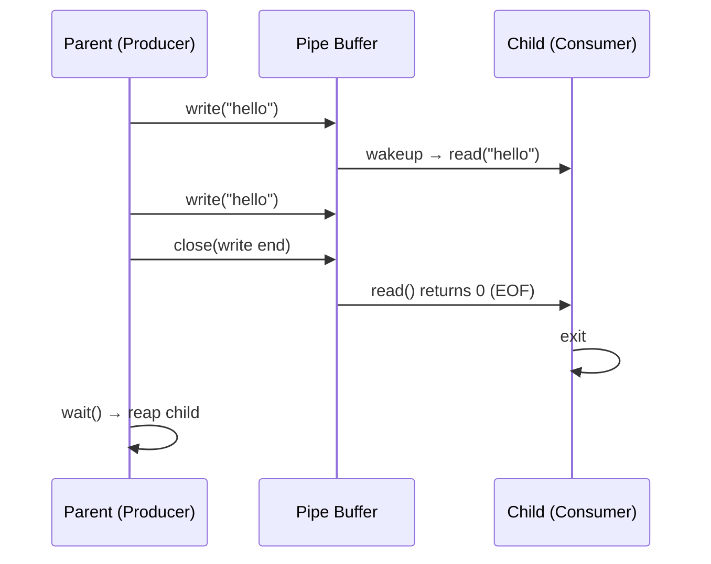
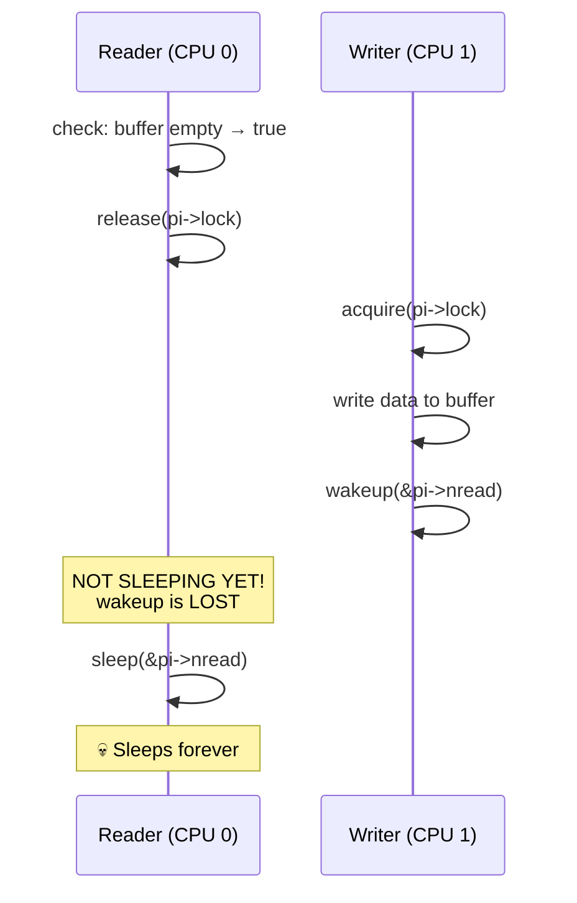
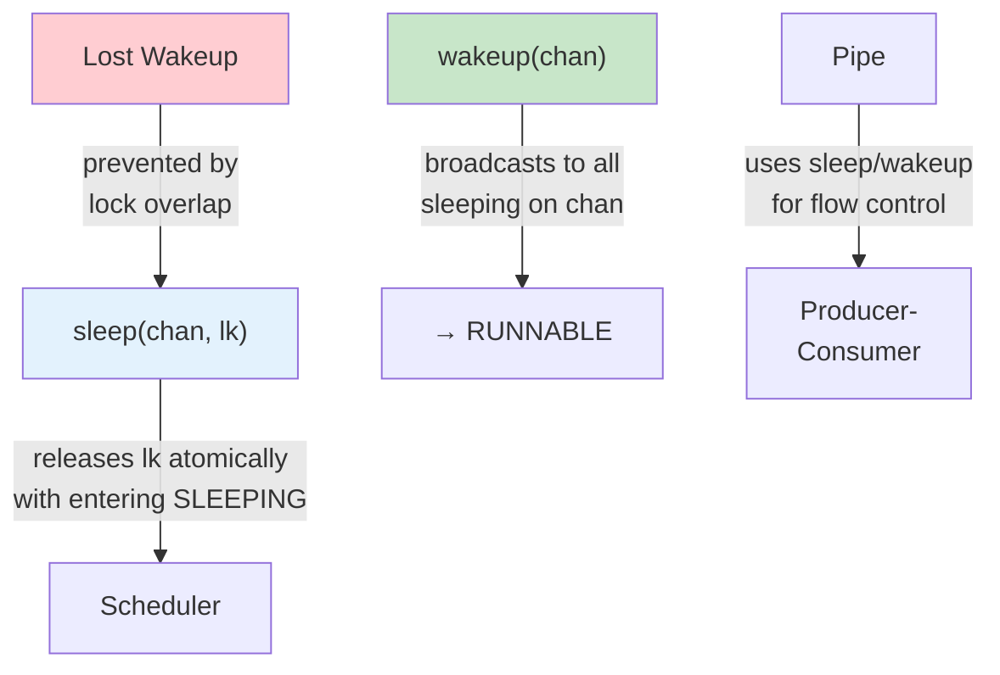

# Operating Systems Lab

## Week 9 — sleep/wakeup and Pipes

Korea University Sejong Campus, Department of Computer Science & Software

---

# Lab Overview

**Objectives**: Analyze xv6 synchronization primitives at the source-code level

| # | Topic | Time |
|---|-------|------|
| 1 | sleep/wakeup code analysis | 15 min |
| 2 | Pipe implementation analysis | 15 min |
| 3 | Producer-consumer with pipes | 15 min |
| 4 | Lost wakeup problem | 5 min |



---

# Exercise 1: sleep/wakeup

**`sleep(chan, lk)`** — `kernel/proc.c`

```c
void sleep(void *chan, struct spinlock *lk) {
  struct proc *p = myproc();
  acquire(&p->lock);   // (1) acquire process lock
  release(lk);         // (2) release condition lock
  p->chan = chan;
  p->state = SLEEPING; // (3) mark as sleeping
  sched();             // (4) yield CPU to scheduler
  p->chan = 0;
  release(&p->lock);
  acquire(lk);         // (5) re-acquire condition lock
}
```



- **Channel** = arbitrary address as event ID (e.g., `&pi->nread`)
- `wakeup(chan)` is a **broadcast**: all processes sleeping on `chan` become RUNNABLE

---

# Exercise 2: Pipe Implementation

**Circular buffer** of 512 bytes — `kernel/pipe.c`

<div class="grid grid-cols-2 gap-4">
<div>

```c
struct pipe {
  struct spinlock lock;
  char data[PIPESIZE]; // 512
  uint nread;          // monotonic
  uint nwrite;         // monotonic
  int readopen;
  int writeopen;
};
// index = nread % PIPESIZE
// full: nwrite == nread + PIPESIZE
```

</div>
<div>



</div>
</div>

**EOF**: when write end closes, `piperead` exits the wait loop and returns 0.

---

# Exercise 3: Producer-Consumer with Pipes

**Pattern**: parent = producer, child = consumer

```c
int fds[2];
pipe(fds);
int pid = fork();

if (pid == 0) {                  // Child — Consumer
    close(fds[1]);
    char buf[64]; int n;
    while ((n = read(fds[0], buf, sizeof(buf))) > 0)
        printf("[Consumer] %s\n", buf);
    close(fds[0]);
    exit(0);
} else {                         // Parent — Producer
    close(fds[0]);
    for (int i = 0; i < 5; i++)
        write(fds[1], "hello", 5);
    close(fds[1]);               // signals EOF
    wait(0);
}
```



---

# Exercise 4: Lost Wakeup Problem

**The problem**: wakeup arrives while the process is **not yet sleeping**



**xv6's fix**: pass the condition lock to `sleep()`

```c
// Inside sleep():
acquire(&p->lock);   // hold p->lock ...
release(lk);         // ... BEFORE releasing condition lock
p->state = SLEEPING; // state set while p->lock held
sched();
```

- Writer's `wakeup()` must acquire `p->lock` to see `p->state`
- Because `p->lock` is held until after `SLEEPING` is set → **no gap**
- "Check condition → go to sleep" is effectively **atomic**

---

# Key Takeaways



| Concept | Key Insight |
|---|---|
| **sleep/wakeup** | Channel = any address; always recheck condition after wakeup |
| **Pipe** | Circular buffer with automatic flow control (full→block writer, empty→block reader) |
| **Lost wakeup** | Fixed by holding `p->lock` across condition check + state change |
