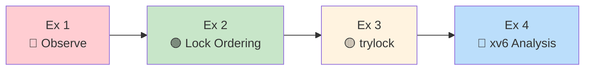
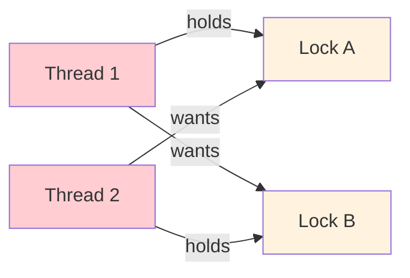
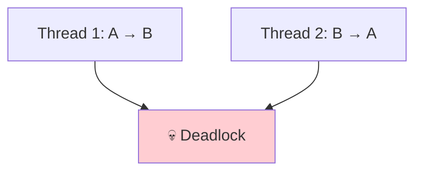
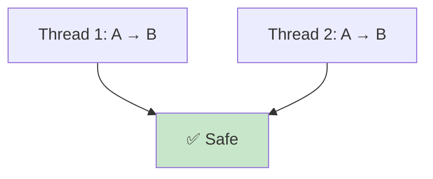
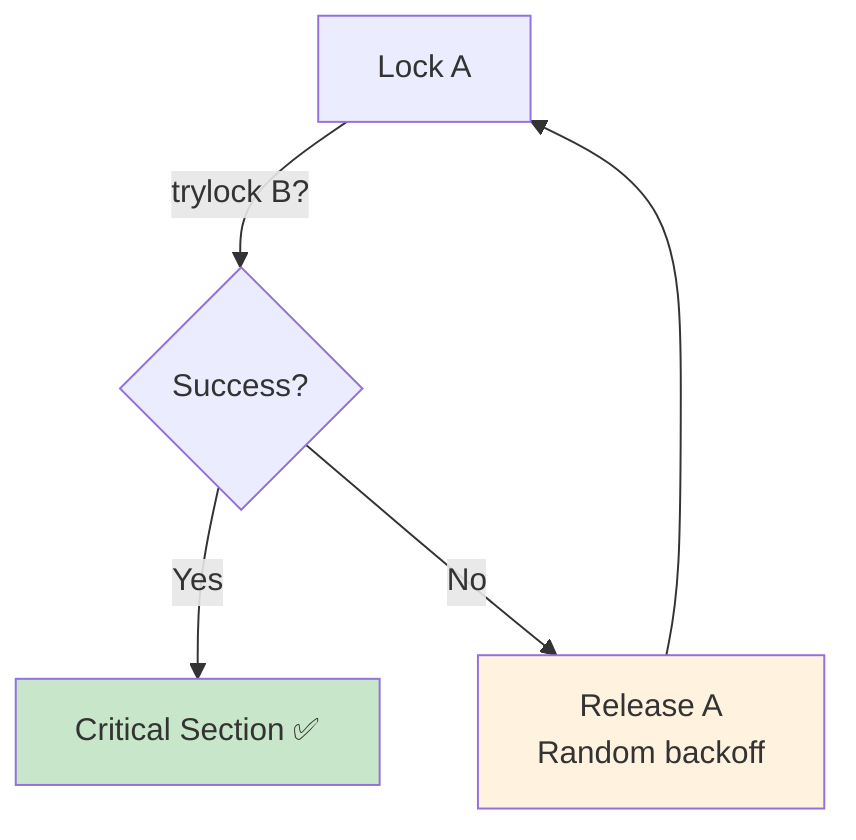
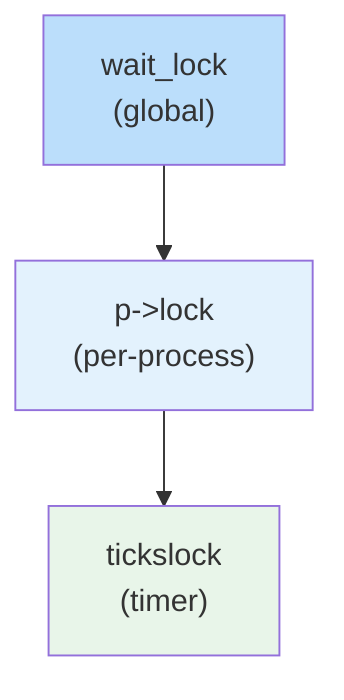
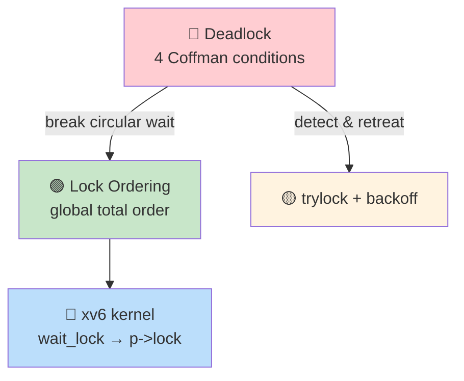

# Operating Systems Lab

## Week 10 — Deadlocks

Korea University Sejong Campus, Department of Computer Science & Software

---

# Lab Overview

**Objectives**: Observe, resolve, and prevent deadlocks in user-space and xv6 kernel

| # | Topic | Time |
|---|-------|------|
| 1 | Observe deadlock with `pthread_mutex` | 10 min |
| 2 | Fix with lock ordering | 10 min |
| 3 | `trylock` + back-off strategy | 15 min |
| 4 | xv6 lock ordering analysis | 15 min |



---

# Exercise 1: Observe Deadlock

**Two threads, two mutexes** — classic circular wait

<div class="grid grid-cols-2 gap-4">
<div>

```c
void *thread1(void *arg) {
  pthread_mutex_lock(&lock_A);
  sleep(1);
  pthread_mutex_lock(&lock_B);
  // ... never reached ...
}

void *thread2(void *arg) {
  pthread_mutex_lock(&lock_B);
  sleep(1);
  pthread_mutex_lock(&lock_A);
  // ... never reached ...
}
```

```bash
./deadlock_demo   # hangs! Ctrl-C to kill
```

</div>
<div>

**Resource Allocation Graph:**



**Cycle detected** → Deadlock!

All 4 Coffman conditions hold:
1. Mutual exclusion
2. Hold and wait
3. No preemption
4. **Circular wait** ←

</div>
</div>

---

# Exercise 2: Lock Ordering Fix

**Principle**: establish a **global total order** — always acquire in the same order

<div class="grid grid-cols-2 gap-4">
<div>

**Before (deadlock):**



</div>
<div>

**After (safe):**



</div>
</div>

```c
// Both threads acquire in the SAME order
void *thread_fixed(void *arg) {
    pthread_mutex_lock(&lock_A);   // always A first
    pthread_mutex_lock(&lock_B);   // then B
    // ... critical section ...
    pthread_mutex_unlock(&lock_B);
    pthread_mutex_unlock(&lock_A);
}
```

**Why it works**: circular wait is impossible — to hold B, you must already hold A.

---

# Exercise 3: trylock Strategy

**`pthread_mutex_trylock`** — non-blocking; returns `EBUSY` if unavailable

```c
void *thread_trylock(void *arg) {
  while (1) {
    pthread_mutex_lock(&lock_A);
    if (pthread_mutex_trylock(&lock_B) == 0) {
      // Success — hold both locks
      // ... critical section ...
      pthread_mutex_unlock(&lock_B);
      pthread_mutex_unlock(&lock_A);
      break;
    }
    // Failed — release A and back off
    pthread_mutex_unlock(&lock_A);
    usleep(rand() % 1000);   // randomized delay
  }
}
```



**Key**: randomized back-off prevents **livelock** (both retrying in lockstep).

---

# Exercise 4: xv6 Lock Ordering

**xv6 enforces a strict global lock hierarchy:**



**Example: `wait()` and `exit()` both follow the same order:**

```c
// wait()                          // exit()
acquire(&wait_lock);    // 1st     acquire(&wait_lock);    // 1st
  acquire(&p->lock);    // 2nd       acquire(&p->lock);    // 2nd
  if (p->state == ZOMBIE)              p->state = ZOMBIE;
  release(&p->lock);                   wakeup(p->parent);
release(&wait_lock);                 release(&p->lock);
                                   release(&wait_lock);
```

- Violating order (holding `p->lock` then acquiring `wait_lock`) → circular wait
- `acquire()` in xv6 **panics** on double-acquire (catches mistakes early)

---

# Key Takeaways



| Strategy | When to Use |
|---|---|
| **Lock ordering** | Default choice — simple, provably correct |
| **trylock + backoff** | When strict ordering is impractical |
| **xv6 discipline** | Every kernel path follows documented lock hierarchy |
