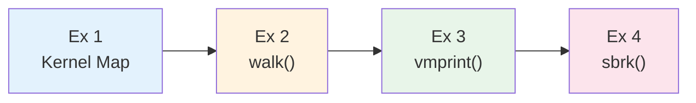
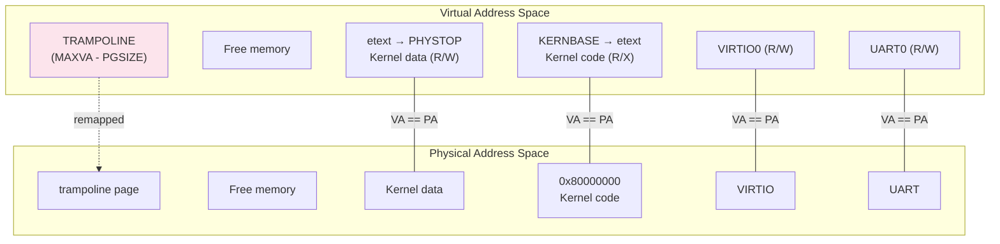
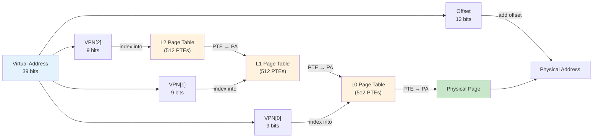
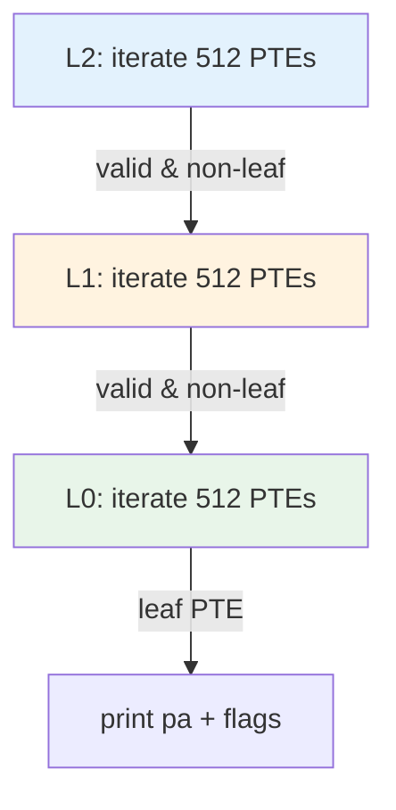
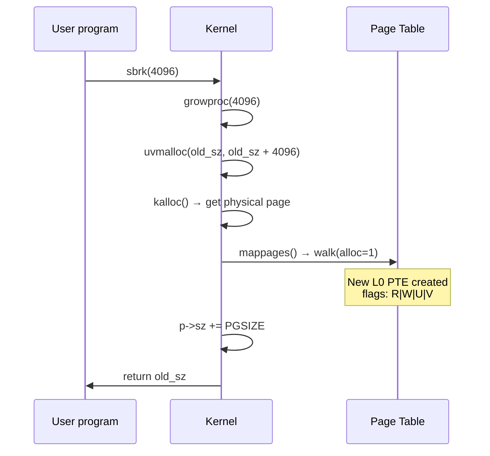
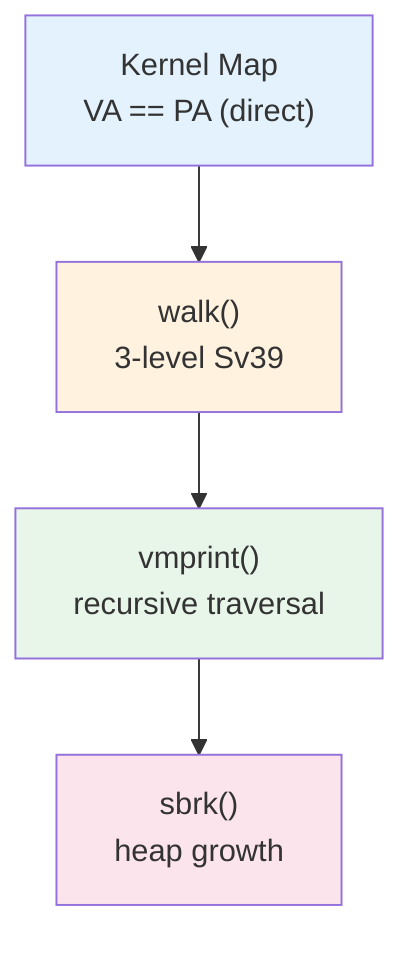

# Operating Systems Lab

## Week 11 — Page Tables

Korea University Sejong Campus, Department of Computer Science & Software

---

# Lab Overview

**Objectives**: Trace address translation and implement `vmprint()` in xv6

| # | Topic | Time |
|---|-------|------|
| 1 | Kernel memory map — `kvmmake()` | 10 min |
| 2 | `walk()` tracing — manual translation | 15 min |
| 3 | `vmprint()` implementation | 15 min |
| 4 | `sbrk()` behavior tracing | 10 min |



---

# Exercise 1: Kernel Memory Map

**`kvmmake()`** — `kernel/vm.c` — builds kernel page table at boot



**Direct mapping**: `VA == PA` for most kernel regions — simplifies pointer arithmetic.
**Exception**: trampoline mapped at top of VA space, shared across all processes.

---

# Exercise 2: walk() Tracing — Sv39

**RISC-V Sv39**: 39-bit virtual address → 3-level page table



**`walk(pagetable, va, alloc)`** — `kernel/vm.c`:
- Traverses 3 levels using `PX(level, va)` to extract VPN bits
- `alloc=1` → allocates missing intermediate pages on demand
- Returns pointer to the **L0 PTE** for the given virtual address

---

# Exercise 3: vmprint() Implementation

**Goal**: Print a page table in the xv6 book format

```
page table 0x0000000087f6b000
 ..0: pte 0x0000000021fd9c01 pa 0x0000000087f67000
 .. ..0: pte 0x0000000021fd9401 pa 0x0000000087f65000
 .. .. ..0: pte 0x0000000021fd98c7 pa 0x0000000087f66000
```

```c
void vmprint_level(pagetable_t pt, int level) {
  for (int i = 0; i < 512; i++) {
    pte_t pte = pt[i];
    if (!(pte & PTE_V)) continue;
    // print with indentation based on level
    printf("%s%d: pte %p pa %p\n",
           indent[level], i, pte, PTE2PA(pte));
    if (level > 0 && (pte & (PTE_R|PTE_W|PTE_X)) == 0)
      vmprint_level((pagetable_t)PTE2PA(pte), level-1);
  }
}
```



**Leaf vs non-leaf**: PTE with **no R/W/X** flags = pointer to next level (recurse). PTE with R/W/X = leaf (print).

---

# Exercise 4: sbrk() Behavior Tracing

**`sbrk(n)`** grows the heap → new pages appear in the page table



**Observation**: Use `vmprint()` **before** and **after** `sbrk()` to see the new PTE appear at the heap boundary.

**What happens inside**:
1. `uvmalloc` calls `kalloc()` for a physical page
2. `mappages` calls `walk(alloc=1)` to create/find PTE entries
3. New L0 PTE: `PTE_R | PTE_W | PTE_U | PTE_V`
4. `p->sz` advances — new VA is now accessible

---

# Key Takeaways



| Concept | Key Insight |
|---|---|
| **Direct mapping** | Kernel VA == PA from KERNBASE up; trampoline is the exception |
| **Sv39** | 3 × 9-bit VPN + 12-bit offset; 512 entries per page table page |
| **walk()** | Traverses 3 levels; `alloc=1` creates missing intermediate pages |
| **vmprint()** | Non-leaf PTE (no R/W/X) → recurse; leaf PTE → print |
| **sbrk()** | `growproc` → `uvmalloc` → `mappages` → `walk` → new PTE |
