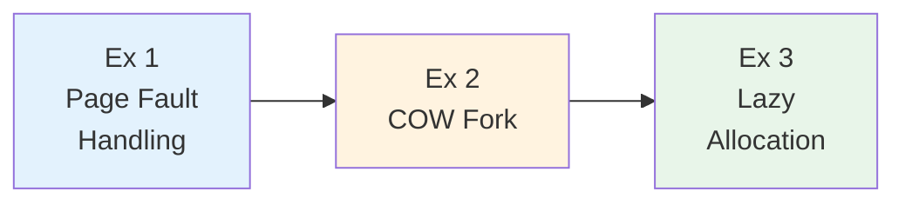
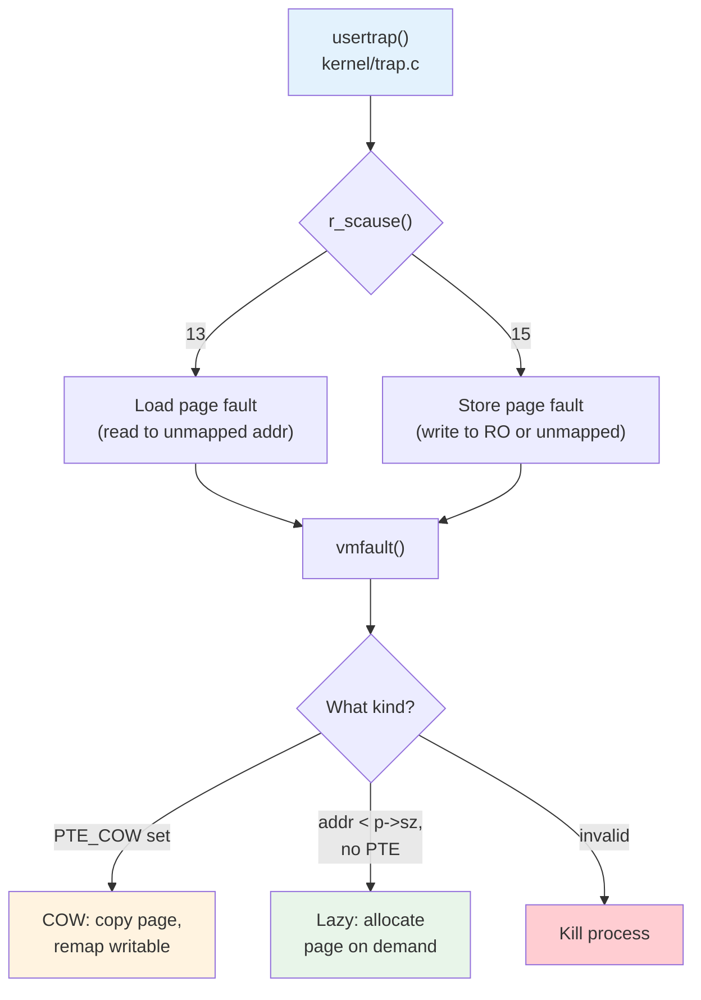
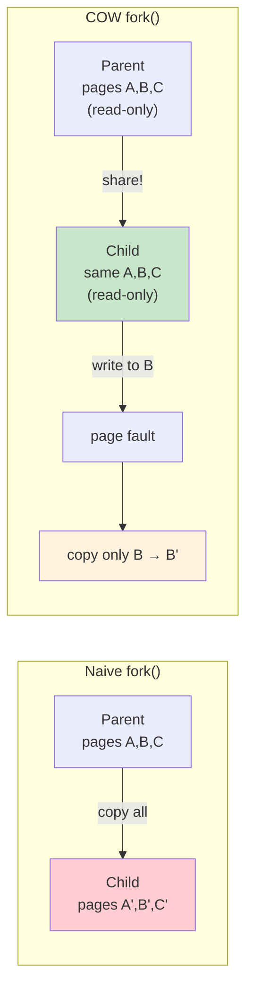
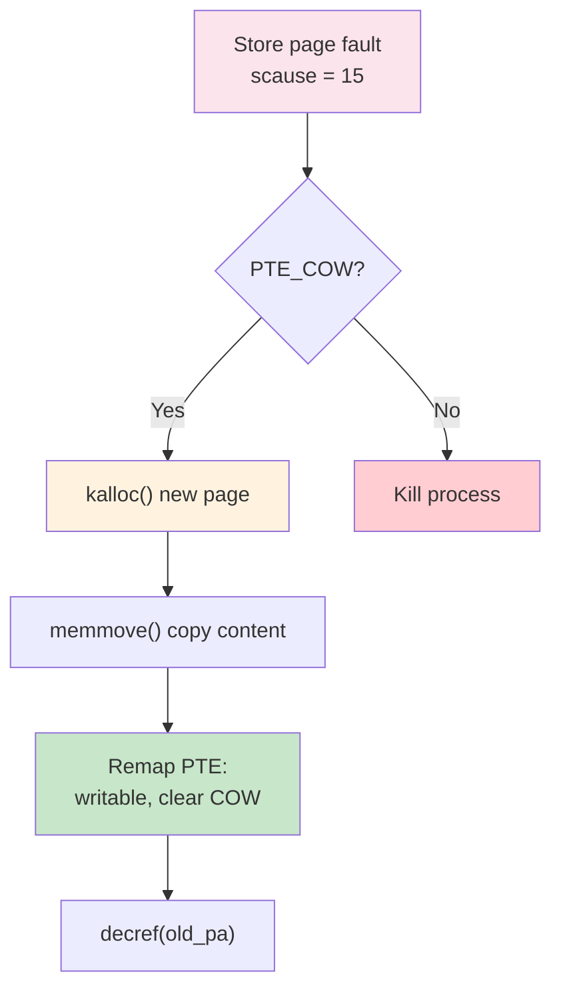
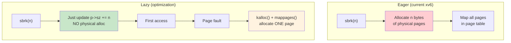
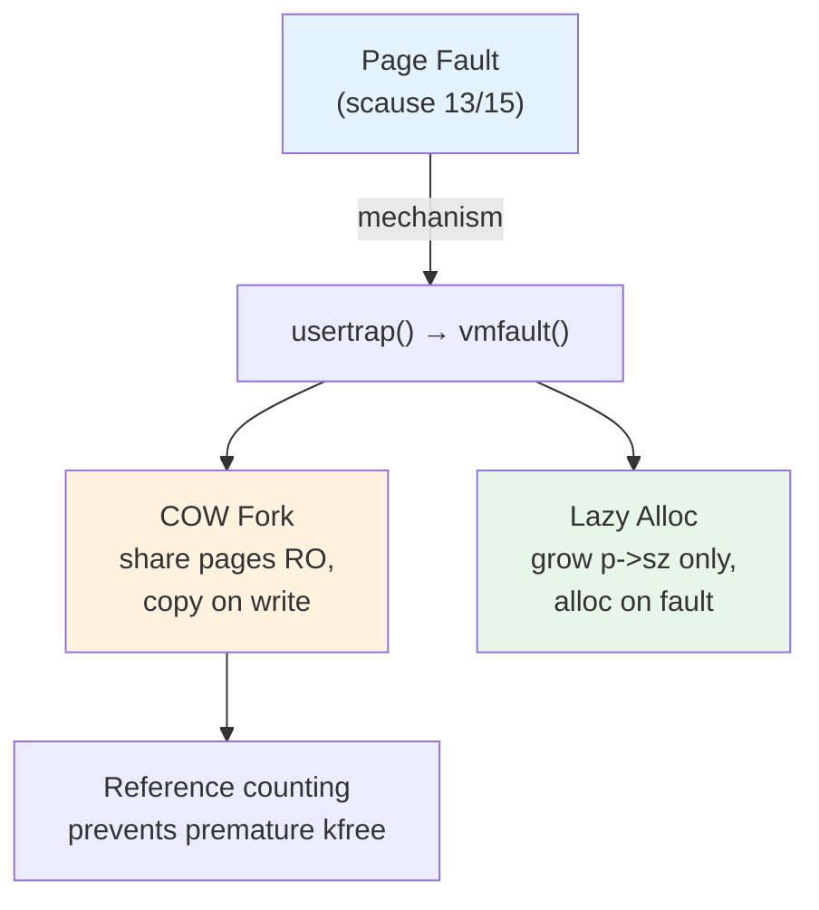

# Operating Systems Lab

## Week 12 — COW Fork & Lazy Allocation

Korea University Sejong Campus, Department of Computer Science & Software

---

# Lab Overview

- **Goal**: Understand page fault handling and design virtual memory optimizations
- **Duration**: ~60 minutes · 3 exercises
- **Key insight**: Page faults are **not errors** — they are opportunities to defer and share work



---

# Exercise 1: Page Fault Handling

**Flow when a user process accesses an unmapped/protected page:**



- `r_stval()` returns the **faulting virtual address**
- **Task**: Read `usertrap()` and identify where page faults are dispatched

---

# Exercise 2: COW Fork — Concept

**Problem**: Naive `fork()` copies ALL physical pages immediately — slow and wasteful



**Why it works**: Most `fork()` children call `exec()` immediately → pages are **never** written → **zero copies** needed!

---

# Exercise 2: COW Fork — Implementation

<div class="grid grid-cols-2 gap-4">
<div>

**Step 1 — `uvmcopy()`: mark PTEs**

```c
*pte &= ~PTE_W;   // clear writable
*pte |= PTE_COW;  // set COW flag
// (RSW bit 8 in PTE)
// child PTE gets same flags
```

**Step 2 — Reference counting**

```c
int refcount[PHYSTOP / PGSIZE];
// increment on fork
// decrement on free
// kfree() only when count → 0
```

</div>
<div>

**Step 3 — Fault handler**



```c
if (*pte & PTE_COW) {
  char *mem = kalloc();
  memmove(mem, old_pa, PGSIZE);
  *pte = PA2PTE(mem) | PTE_W;
  *pte &= ~PTE_COW;
  decref(old_pa);
}
```

</div>
</div>

---

# Exercise 3: Lazy Allocation

**Problem**: `sbrk(n)` allocates `n` bytes of physical memory even if the process never uses it



**Edge cases to handle**:
- `sbrk(-n)`: must `uvmdealloc()` existing pages
- Stack guard page: must still fault fatally
- Syscall I/O: `walkaddr()` must trigger allocation for lazy pages passed to `read()`/`write()`

---

# Key Takeaways



| Concept | Key Insight |
|---|---|
| **Page faults** | Not errors — opportunities to defer work |
| **COW fork** | Share pages RO + PTE_COW; copy only on write |
| **Refcount** | Track sharing; `kfree` only when count reaches 0 |
| **Lazy alloc** | `sbrk` updates `p->sz` only; physical pages on demand |
| **Pitfall** | Kernel must handle lazy pages in `walkaddr()` for syscall I/O |
