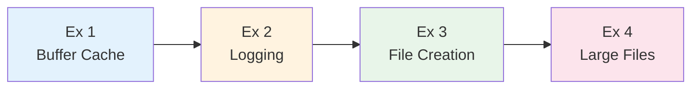
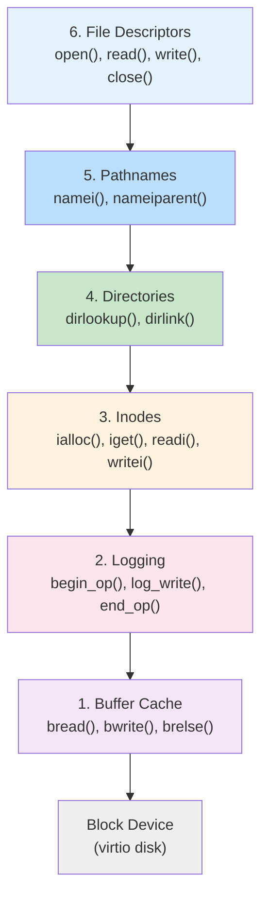
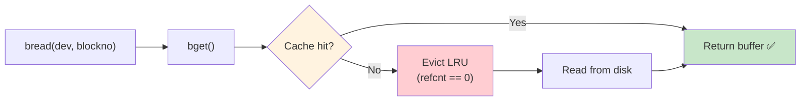
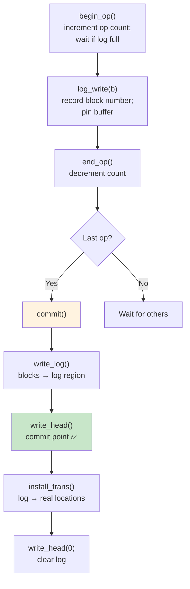
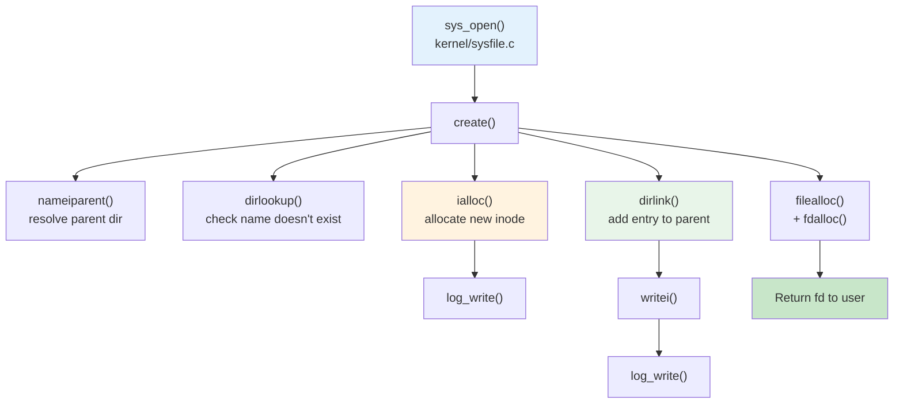
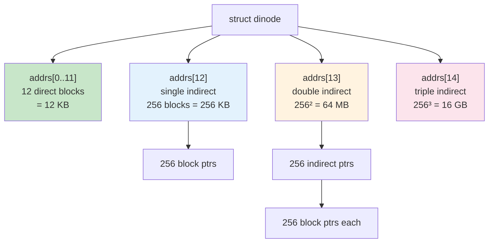
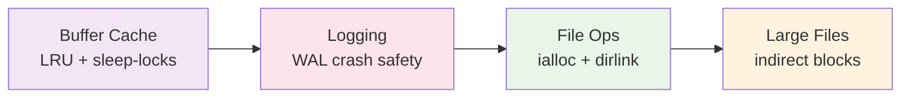

# Operating Systems Lab

## Week 13 — File System Internals

Korea University Sejong Campus, Department of Computer Science & Software

---

# Lab Overview

- **Goal**: Analyze the xv6 file system layer by layer, trace file operations end-to-end
- **Duration**: ~50 minutes · 4 exercises
- **Reference**: `kernel/bio.c`, `kernel/log.c`, `kernel/fs.c`, `kernel/sysfile.c`

---

# xv6 File System — 6 Layers

- Each layer relies **only** on the layer below
- **Logging** provides crash safety
- **Buffer cache** ensures one in-memory copy per disk block

---

# Exercise 1: Buffer Cache

**Purpose**: Cache disk blocks in memory; serialize access with sleep-locks

**Key functions in `kernel/bio.c`:**

| Function | Role |
|---|---|
| `binit()` | Initialize doubly-linked LRU list |
| `bget()` | Return cached block or evict LRU entry |
| `bread()` | `bget()` + read from disk if not valid |
| `bwrite()` | Write buffer to disk |
| `brelse()` | Release buffer; move to MRU end |

- `buf.refcnt == 0` → evictable
- Each buffer has a **sleeplock** — one process at a time

---

# Exercise 2: Logging System

**Write-ahead logging (WAL)** — guarantees atomic multi-block updates across crashes

**Crash recovery** (`recover_from_log()` at boot):
- Committed header found → re-run `install_trans()`
- No committed header → discard log, disk is consistent

---

# Exercise 3: File Creation Tracing

**Full call chain for `open("newfile", O_CREATE)`:**

**Task**: Set a breakpoint at `ialloc()` in GDB and verify the inode type and device number are set correctly before `log_write()`.

---

# Exercise 4: Large File Support

**xv6 inode block layout** (`struct dinode` in `kernel/fs.h`):

| Level | Formula | Max Size |
|---|---|---|
| Direct | 12 blocks | 12 KB |
| Single indirect | 256 blocks | 256 KB |
| Double indirect | 256 × 256 | 64 MB |
| Triple indirect | 256³ | 16 GB |

**Task**: Modify `bmap()` in `kernel/fs.c` to support **double-indirect** blocks.

---

# Key Takeaways

| Concept | Key Insight |
|---|---|
| **Buffer cache** | One copy per block; LRU eviction; sleep-locks |
| **Logging** | `write_head()` = commit point; recovery replays committed txns |
| **File creation** | Touches inode block + parent dir block — both wrapped in a transaction |
| **Large files** | Indirect blocks multiply capacity: 256/block → each level adds ×256 |

> The file system is the most complex xv6 subsystem. Reading it **layer by layer** is the most effective approach.
